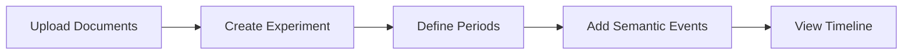

# OntExtract Documentation Plan

**Created:** 2025-11-23
**Status:** Planning Phase
**Target:** User manual with in-app access and eventual GitHub Pages deployment

---

## Executive Summary

Create comprehensive user documentation for OntExtract using MkDocs Material, served initially through Flask app with a dedicated menu item, and later migrated to GitHub Pages for wider accessibility.

**Primary Goal:** Enable digital humanities researchers to use OntExtract without technical assistance.

**Secondary Goal:** Reduce support burden by providing clear, searchable, screenshot-rich guides.

---

## Documentation Tool Selection

### Recommended: MkDocs Material

**Rationale:**
- Markdown-based (easy to write and maintain)
- Beautiful, modern UI with dark mode support
- Built-in search functionality
- Mobile-responsive
- Offline-capable (critical for standalone mode users)
- Easy integration with Flask and GitHub Pages
- Minimal dependencies (Python-based)

**Setup:**
```bash
pip install mkdocs-material
pip install mkdocs-minify-plugin
pip install mkdocs-git-revision-date-localized-plugin
```

**Configuration:** `mkdocs.yml` at project root

**Build Output:** Static HTML in `site/` directory

---

## Content Structure

### Phase 1: User Manual Core (Immediate Priority)

```
docs/
├── index.md                           # Welcome, quick start, what is OntExtract
├── getting-started/
│   ├── installation.md                # Setup, database, environment
│   ├── first-login.md                 # Account creation, interface overview
│   └── operational-modes.md           # Standalone vs API-enhanced
│
├── user-guide/
│   ├── terms/
│   │   ├── creating-terms.md          # Basic term creation
│   │   ├── dictionary-references.md   # MW/OED integration, Quick Add
│   │   └── managing-terms.md          # Edit, delete, search
│   │
│   ├── documents/
│   │   ├── uploading-documents.md     # PDF/TXT upload, metadata
│   │   ├── document-metadata.md       # Publication dates, authors, chapters
│   │   ├── document-types.md          # Source vs reference distinction
│   │   └── document-versioning.md     # Experimental vs processed versions
│   │
│   ├── experiments/
│   │   ├── overview.md                # Experiment types comparison table
│   │   ├── temporal-evolution/
│   │   │   ├── creating.md            # Step-by-step experiment creation
│   │   │   ├── periods.md             # Defining temporal periods, auto-generation
│   │   │   ├── semantic-events.md     # Creating events, ontology types, citations
│   │   │   ├── timeline-view.md       # Management view, full-page view, navigation
│   │   │   └── workflow.md            # Complete end-to-end example
│   │   │
│   │   ├── domain-comparison.md       # (Post-JCDL, currently disabled)
│   │   └── entity-extraction.md       # (Post-JCDL)
│   │
│   └── ontology/
│       ├── semantic-change-types.md   # Event type catalog with definitions
│       ├── citations.md               # Academic foundation (12 papers)
│       └── validation.md              # Pellet reasoner, BFO alignment
│
├── how-to/
│   ├── upload-document-collection.md  # Batch upload workflow
│   ├── create-temporal-experiment.md  # Complete walkthrough (agent example)
│   ├── export-timeline.md             # Screenshots, provenance export
│   ├── interpret-provenance.md        # Understanding PROV-O output
│   └── troubleshooting.md             # Common issues, solutions
│
└── faq.md                              # Frequently asked questions

```

### Phase 2: Advanced Features (Post-Core)

```
docs/
├── user-guide/
│   └── llm-orchestration/
│       ├── overview.md                 # 5-stage workflow explanation
│       ├── stage1-analyze.md           # What LLM analyzes
│       ├── stage2-recommend.md         # Tool selection, strategy
│       ├── stage3-review.md            # Human-in-the-loop approval
│       ├── stage4-execute.md           # Monitoring progress
│       ├── stage5-synthesize.md        # Cross-document insights
│       └── api-key-setup.md            # Anthropic API configuration
│
└── advanced/
    ├── provenance-tracking.md          # PROV-O deep dive
    ├── custom-processing.md            # Manual tool selection
    ├── settings.md                     # Admin settings (API-enhanced mode)
    └── database-backup.md              # Data management
```

### Phase 3: Reference & Developer Docs (Future)

```
docs/
├── reference/
│   ├── api-endpoints.md                # REST API documentation
│   ├── data-models.md                  # Database schema
│   ├── nlp-tools.md                    # Processing tool catalog
│   └── ontology-spec.md                # Semantic Change Ontology v2.0
│
└── developer/
    ├── architecture.md                 # System overview
    ├── contributing.md                 # How to extend
    └── deployment.md                   # Production setup
```

---

## Integration with Flask App

### Menu Placement

**Location:** Main navigation bar (between "Linked Data" and user dropdown)

**Type:** Simple nav link (not dropdown initially)

**Label:** "Documentation" or "Help"

**Icon:** `<i class="fas fa-book"></i>` or `<i class="fas fa-circle-question"></i>`

**Code Change:** [app/templates/base.html](app/templates/base.html:270)

```html
<!-- Add after Linked Data nav item -->
<li class="nav-item">
    <a class="nav-link" href="{{ url_for('docs.index') }}">
        <i class="fas fa-book me-1"></i> Documentation
    </a>
</li>
```

### Flask Route Setup

**New Blueprint:** `app/routes/docs.py`

```python
from flask import Blueprint, send_from_directory, abort
from pathlib import Path

docs_bp = Blueprint('docs', __name__, url_prefix='/docs')

# Serve MkDocs-built static site
DOCS_DIR = Path(__file__).parent.parent.parent / 'site'

@docs_bp.route('/')
@docs_bp.route('/<path:path>')
def index(path='index.html'):
    """Serve documentation static files"""
    if not path.endswith('.html') and not path.endswith('.css') and not path.endswith('.js'):
        # Handle clean URLs (e.g., /docs/getting-started/installation)
        path = f"{path}/index.html" if path else "index.html"

    try:
        return send_from_directory(DOCS_DIR, path)
    except FileNotFoundError:
        abort(404)
```

**Register Blueprint:** [app/__init__.py](app/__init__.py)

```python
from app.routes.docs import docs_bp
app.register_blueprint(docs_bp)
```

### Build Process

**Development:** Auto-rebuild on save
```bash
mkdocs serve --dev-addr=127.0.0.1:8001
# Accessible at http://localhost:8001 (separate port for testing)
```

**Production:** Build static site before deploying Flask app
```bash
mkdocs build  # Generates site/ directory
# Flask serves site/ directory at /docs route
```

**Integration with run.py:** Add optional documentation build step

```python
# In run.py (optional)
import subprocess
import os

if os.environ.get('BUILD_DOCS', 'false').lower() == 'true':
    subprocess.run(['mkdocs', 'build'], check=True)
    print("Documentation built successfully")
```

---

## MkDocs Configuration

**File:** `mkdocs.yml` (project root)

```yaml
site_name: OntExtract Documentation
site_description: User manual for OntExtract historical document analysis platform
site_author: OntExtract Project
site_url: https://ontextract.ontorealm.net/docs

# Repository (for GitHub Pages migration)
repo_url: https://github.com/MatLab-Research/OntExtract
repo_name: OntExtract
edit_uri: edit/main/docs/

theme:
  name: material
  palette:
    # Dark mode (matches OntExtract Darkly theme)
    - scheme: slate
      primary: blue
      accent: teal
      toggle:
        icon: material/brightness-4
        name: Switch to light mode
    # Light mode (optional)
    - scheme: default
      primary: blue
      accent: teal
      toggle:
        icon: material/brightness-7
        name: Switch to dark mode

  features:
    - navigation.instant      # SPA-like navigation
    - navigation.tracking     # URL updates with scroll
    - navigation.tabs         # Top-level tabs
    - navigation.sections     # Expandable sections
    - navigation.expand       # Expand sections by default
    - navigation.top          # Back to top button
    - search.suggest          # Search suggestions
    - search.highlight        # Highlight search terms
    - content.code.copy       # Copy code blocks
    - content.action.edit     # Edit on GitHub link

  icon:
    logo: material/brain
    repo: fontawesome/brands/github

plugins:
  - search:
      lang: en
  - minify:
      minify_html: true
  - git-revision-date-localized:
      enable_creation_date: true

markdown_extensions:
  - admonition              # Callout boxes (note, warning, tip)
  - pymdownx.details        # Collapsible admonitions
  - pymdownx.superfences    # Code blocks with syntax highlighting
  - pymdownx.tabbed:        # Tabbed content
      alternate_style: true
  - pymdownx.emoji:         # Emoji support
      emoji_index: !!python/name:material.extensions.emoji.twemoji
      emoji_generator: !!python/name:material.extensions.emoji.to_svg
  - attr_list               # Add CSS classes to elements
  - md_in_html              # Markdown inside HTML
  - tables                  # Table support
  - toc:
      permalink: true       # Anchor links for headings

nav:
  - Home: index.md
  - Getting Started:
      - Installation: getting-started/installation.md
      - First Login: getting-started/first-login.md
      - Operational Modes: getting-started/operational-modes.md
  - User Guide:
      - Terms:
          - Creating Terms: user-guide/terms/creating-terms.md
          - Dictionary References: user-guide/terms/dictionary-references.md
          - Managing Terms: user-guide/terms/managing-terms.md
      - Documents:
          - Uploading Documents: user-guide/documents/uploading-documents.md
          - Document Metadata: user-guide/documents/document-metadata.md
          - Document Types: user-guide/documents/document-types.md
      - Experiments:
          - Overview: user-guide/experiments/overview.md
          - Temporal Evolution:
              - Creating Experiments: user-guide/experiments/temporal-evolution/creating.md
              - Defining Periods: user-guide/experiments/temporal-evolution/periods.md
              - Semantic Events: user-guide/experiments/temporal-evolution/semantic-events.md
              - Timeline View: user-guide/experiments/temporal-evolution/timeline-view.md
              - Complete Workflow: user-guide/experiments/temporal-evolution/workflow.md
      - Ontology:
          - Semantic Change Types: user-guide/ontology/semantic-change-types.md
          - Citations: user-guide/ontology/citations.md
  - How-To Guides:
      - Create Temporal Experiment: how-to/create-temporal-experiment.md
      - Upload Document Collection: how-to/upload-document-collection.md
      - Export Timeline: how-to/export-timeline.md
      - Troubleshooting: how-to/troubleshooting.md
  - FAQ: faq.md

extra:
  social:
    - icon: fontawesome/brands/github
      link: https://github.com/MatLab-Research/OntExtract
```

---

## Content Guidelines

### Writing Style

**Tone:**
- Clear, direct, professional
- Avoid academic jargon where possible
- Define technical terms on first use
- Use second person ("you") for instructions

**Structure:**
- Start each page with brief overview
- Use numbered steps for procedures
- Include screenshots for UI elements
- Provide examples for abstract concepts
- End with "Next Steps" or "See Also" sections

**Example:**

```markdown
# Creating a Temporal Evolution Experiment

A temporal evolution experiment tracks how term meanings change across historical periods.

## Prerequisites

Before creating an experiment, you should:

- [Create a focus term](../terms/creating-terms.md)
- [Upload source documents](../documents/uploading-documents.md) with publication dates
- [Add dictionary references](../terms/dictionary-references.md) (optional)

## Step 1: Navigate to Experiments

1. Click **Experiments** in the main navigation
2. Click the **New Experiment** button


## Step 2: Select Focus Term

1. Click the **Focus Term** dropdown
2. Select your term (e.g., "agent")
3. The experiment name auto-fills to "[term] Temporal Evolution"

!!! tip
    The description field also auto-fills with a template. You can customize this to describe your specific research goals.

## Step 3: Select Experiment Type

...
```

### Admonitions (Callout Boxes)

Use MkDocs Material admonitions for important information:

```markdown
!!! note
    This is a note - supplementary information.

!!! tip
    This is a tip - helpful suggestion.

!!! warning
    This is a warning - potential issues.

!!! danger
    This is a danger - critical issues that cause errors.

!!! example
    This is an example - concrete use case.
```

### Screenshots

**Naming Convention:**
- Descriptive, kebab-case filenames
- Include page/feature name
- Example: `experiments-new-focus-term-dropdown.png`

**Location:** `docs/assets/screenshots/`

**Requirements:**
- High resolution (1920x1080 or higher)
- Crop to relevant UI elements (no excessive whitespace)
- Annotate with arrows/boxes where needed (use tool like Greenshot, Snagit, or Figma)
- Dark mode screenshots (matches OntExtract theme)

**Tools:**
- Greenshot (Windows) - free, annotation support
- Flameshot (Linux) - free, built-in annotation
- Snagit (cross-platform) - paid, professional features

**Naming Pattern:**
```
docs/assets/screenshots/
├── experiments/
│   ├── experiments-list.png
│   ├── experiments-new-button.png
│   ├── experiments-new-focus-term.png
│   ├── experiments-new-type-selection.png
│   └── experiments-new-document-selection.png
├── timeline/
│   ├── timeline-management-view.png
│   ├── timeline-fullpage-view.png
│   ├── timeline-add-event-modal.png
│   └── timeline-event-type-dropdown.png
└── terms/
    ├── terms-list.png
    ├── terms-create-button.png
    └── terms-quick-add-reference.png
```

---

## Asset Management

### Directory Structure

```
docs/
├── assets/
│   ├── screenshots/       # UI screenshots
│   ├── diagrams/          # Architecture, workflow diagrams
│   ├── icons/             # Custom icons if needed
│   └── videos/            # Screencasts (future, optional)
├── getting-started/
├── user-guide/
├── how-to/
└── index.md
```

### Diagram Tools

**Recommended:** Mermaid (embedded in markdown)

```markdown

```

**Alternative:** Draw.io (export as SVG)

---

## GitHub Pages Migration Plan

### Phase 1: Local Development (Current)

- Docs served at `/docs` route in Flask app
- Build with `mkdocs build`
- Flask serves `site/` directory
- Test on localhost:8765/docs

### Phase 2: GitHub Repository Setup

1. **Repository Structure:**
   ```
   OntExtract/
   ├── docs/              # Markdown source
   ├── mkdocs.yml         # Configuration
   ├── site/              # Built docs (gitignored)
   └── .github/
       └── workflows/
           └── docs.yml   # GitHub Actions workflow
   ```

2. **GitHub Actions Workflow:**
   ```yaml
   # .github/workflows/docs.yml
   name: Deploy Documentation

   on:
     push:
       branches:
         - main
       paths:
         - 'docs/**'
         - 'mkdocs.yml'

   jobs:
     deploy:
       runs-on: ubuntu-latest
       steps:
         - uses: actions/checkout@v3
         - uses: actions/setup-python@v4
           with:
             python-version: 3.x
         - run: pip install mkdocs-material mkdocs-minify-plugin
         - run: mkdocs gh-deploy --force
   ```

3. **GitHub Pages Settings:**
   - Repository → Settings → Pages
   - Source: gh-pages branch
   - URL: `https://[username].github.io/OntExtract/`

### Phase 3: Dual Deployment (Transitional)

- Keep `/docs` route in Flask app (offline users)
- Also deploy to GitHub Pages (online users, broader reach)
- Update in-app menu to link to GitHub Pages or local docs based on configuration

**Configuration:**
```python
# config.py
DOCS_URL = os.environ.get('DOCS_URL', '/docs')  # Default: in-app
# For production: DOCS_URL = 'https://[username].github.io/OntExtract/'
```

**Menu Link:**
```html
<a class="nav-link" href="{{ config.DOCS_URL }}">
    <i class="fas fa-book me-1"></i> Documentation
</a>
```

### Phase 4: Full Migration (Future)

- Remove `/docs` route from Flask app
- All documentation links point to GitHub Pages
- Keep markdown source in repo for community contributions

---

## Maintenance Workflow

### Documentation Updates

**When to Update:**
- New features added to UI
- Existing features modified
- User questions reveal unclear docs
- Bug fixes that affect user workflows

**Process:**
1. Edit markdown files in `docs/` directory
2. Preview locally: `mkdocs serve`
3. Check screenshots are up to date
4. Commit changes to git
5. Build static site: `mkdocs build`
6. Deploy (push to GitHub or rebuild Flask app)

**Responsibility:**
- Developer implementing feature updates corresponding docs
- Include docs updates in pull requests
- Review checklist: "Does this PR need docs update?"

### Version Control

**Git Workflow:**
- Track markdown source files in git
- Ignore `site/` directory (built output)
- Use meaningful commit messages for docs changes

**.gitignore:**
```
site/
```

**Commit Message Examples:**
- "docs: add temporal evolution workflow guide"
- "docs: update screenshots for new experiment UI"
- "docs: fix broken links in ontology section"

### Screenshots Update Schedule

**Trigger for Updates:**
- UI redesign
- New features added
- User reports outdated screenshots

**Process:**
1. Identify affected pages
2. Recreate screenshots with consistent settings
3. Update markdown image references
4. Test all image links work

---

## Implementation Phases

### Phase 1: Foundation (Week 1)

**Tasks:**
- [ ] Install MkDocs Material
- [ ] Create `mkdocs.yml` configuration
- [ ] Set up basic directory structure
- [ ] Write `index.md` (welcome page)
- [ ] Create Flask blueprint for `/docs` route
- [ ] Add menu item to navigation bar
- [ ] Test local serving

**Deliverables:**
- Working `/docs` route in Flask app
- Empty documentation structure ready for content

### Phase 2: Core User Manual (Week 2-3)

**Tasks:**
- [ ] Getting Started section (3 pages)
- [ ] Terms section (3 pages)
- [ ] Documents section (4 pages)
- [ ] Temporal Evolution experiments (5 pages)
- [ ] Ontology section (3 pages)
- [ ] Capture 30-40 screenshots
- [ ] Write 2-3 how-to guides

**Deliverables:**
- Complete user manual for primary workflow
- Temporal evolution fully documented
- Screenshot library established

### Phase 3: Advanced Features (Week 4)

**Tasks:**
- [ ] LLM Orchestration section (7 pages)
- [ ] Advanced topics (4 pages)
- [ ] FAQ compilation (20+ questions)
- [ ] How-to guide expansion (5 guides)

**Deliverables:**
- Complete documentation for all features
- Comprehensive troubleshooting guide

### Phase 4: GitHub Migration (Week 5)

**Tasks:**
- [ ] Set up GitHub Actions workflow
- [ ] Configure GitHub Pages
- [ ] Test deployment
- [ ] Add edit links to pages
- [ ] Update in-app links to GitHub Pages

**Deliverables:**
- Public documentation site
- Automated deployment pipeline

---

## Testing Plan

### Pre-Launch Testing

**Content Review:**
- [ ] All links work (internal and external)
- [ ] All screenshots display correctly
- [ ] Code blocks have proper syntax highlighting
- [ ] Admonitions render properly
- [ ] Navigation structure is logical

**User Testing:**
- [ ] Ask 2-3 users to follow a guide from start to finish
- [ ] Identify unclear sections
- [ ] Collect feedback on missing topics
- [ ] Test on different screen sizes (desktop, tablet)

**Technical Testing:**
- [ ] Search functionality works
- [ ] Dark mode toggle works
- [ ] Print styles acceptable
- [ ] Page load speed acceptable
- [ ] Works in Chrome, Firefox, Safari, Edge

### Post-Launch Monitoring

**Metrics to Track:**
- Most visited pages (use Umami analytics)
- Search queries (what are users looking for?)
- 404 errors (broken links)
- User feedback submissions

**Feedback Collection:**
- Add "Was this page helpful?" widget to each page
- Link to GitHub issues for documentation bugs
- Email address for general documentation feedback

---

## Success Criteria

**Immediate Success (After Phase 2):**
- [ ] Users can complete temporal evolution workflow without assistance
- [ ] Support questions reduced by 50%
- [ ] All demo experiment steps documented

**Long-Term Success (After Phase 4):**
- [ ] Zero "how do I..." questions that are covered in docs
- [ ] Users contribute documentation improvements via GitHub
- [ ] Conference attendees reference docs during presentations
- [ ] Search functionality resolves 80% of user queries

---

## Resource Requirements

### Software

**Required:**
- Python 3.8+ (already installed)
- MkDocs Material (`pip install mkdocs-material`)
- Screenshot tool (Greenshot/Flameshot - free)

**Optional:**
- Draw.io Desktop (diagrams)
- Typora or Obsidian (markdown editing)
- Grammarly (writing quality)

### Time Estimates

**Phase 1 (Foundation):** 4-6 hours
- Setup and configuration: 2 hours
- Flask integration: 2 hours
- Testing: 1-2 hours

**Phase 2 (Core Manual):** 20-30 hours
- Writing content: 15-20 hours (18 pages × 1 hour each)
- Screenshots: 5-8 hours (40 screenshots × 10 minutes each)
- Review and editing: 3-5 hours

**Phase 3 (Advanced):** 15-20 hours
- Writing: 10-15 hours
- Screenshots: 3-5 hours
- FAQ compilation: 2-3 hours

**Phase 4 (GitHub Migration):** 3-5 hours
- Setup: 2-3 hours
- Testing: 1-2 hours

**Total:** 42-61 hours

---

## Next Steps

1. **Review this plan** - Adjust priorities, structure, or approach
2. **Create Phase 1 implementation ticket** - Set up infrastructure
3. **Take baseline screenshots** - Capture current UI before it changes
4. **Draft first 3 pages** - Test writing style and structure
5. **User feedback loop** - Share drafts with target users

---

## Configuration Confirmed

1. **GitHub repository:** https://github.com/MatLab-Research/OntExtract (public)
2. **Version selector:** Single version only (no version selector needed)
3. **Visual content:** Static screenshots using Flameshot (no videos)
4. **Target audience:** Digital humanities researchers with NLP knowledge, minimal coding experience
5. **Contribution model:** Open to community contributions eventually
6. **Translation:** English only (current scope)

## Outstanding Questions

1. **License:** What license for documentation (CC-BY? MIT?)?
2. **Contribution guidelines:** Specific process for external documentation improvements?

---

## Appendix: MkDocs Material Features Showcase

### Admonitions Example

```markdown
!!! note "Custom Title"
    This is a note with a custom title.

!!! tip "Pro Tip: Auto-Fill Features"
    When you select a focus term, the experiment name automatically fills in with "[term] Temporal Evolution". This saves time during experiment creation.
```

### Tabbed Content Example

```markdown
=== "Standalone Mode"
    In standalone mode, all features work without an API key.

    - Manual tool selection
    - Ontology-backed event types
    - Timeline visualization

=== "API-Enhanced Mode"
    With an Anthropic API key, you get additional features:

    - Automated tool selection
    - Cross-document synthesis
    - LLM-suggested semantic events
```

### Code Blocks with Highlighting

```markdown
```python
# Example: Creating an experiment programmatically
experiment = Experiment(
    name="agent Temporal Evolution",
    experiment_type="temporal_evolution",
    user_id=current_user.id,
    term_id=term.id
)
db.session.add(experiment)
db.session.commit()
```
```

---

**Document Version:** 1.0
**Last Updated:** 2025-11-23
**Next Review:** After Phase 1 implementation
