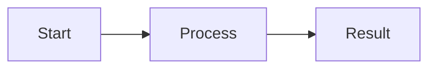

# Documentation Content Templates

Templates and outlines for writing OntExtract documentation pages.

---

## Template 1: Getting Started Page

**Use for:** Installation, setup, first-time user guides

```markdown
# [Page Title]

Brief 1-2 sentence overview of what this page covers.

## What You'll Need

- Prerequisite 1
- Prerequisite 2
- Prerequisite 3

## Overview

2-3 paragraphs explaining the context and why this step matters.

## Step-by-Step Instructions

### Step 1: [Action Name]

Brief explanation of what this step does.

1. First substep
2. Second substep
3. Third substep


!!! tip "Helpful Hint"
    Additional context or shortcut.

### Step 2: [Action Name]

...

## Verification

How to confirm this step worked correctly:

- [ ] Check 1
- [ ] Check 2
- [ ] Check 3

## Troubleshooting

### Issue: [Common Problem]

**Symptom:** What the user sees

**Solution:** How to fix it

## Next Steps

After completing this guide, you can:

- [Related task 1](link.md)
- [Related task 2](link.md)
```

**Example:** `docs/getting-started/installation.md`

---

## Template 2: How-To Guide (Task-Based)

**Use for:** Complete workflows, end-to-end examples

```markdown
# How to [Complete Task]

Learn how to [task outcome] using [feature/workflow].

## Use Case

When should you use this approach? What problem does it solve?

## Prerequisites

Before starting, make sure you have:

- [ ] Prerequisite 1 ([link to setup guide](link.md))
- [ ] Prerequisite 2
- [ ] Prerequisite 3

## Example Scenario

We'll walk through [concrete example, e.g., "creating a temporal evolution experiment for the term 'agent' from 1910-2024"].

### What We'll Create

- Item 1
- Item 2
- Item 3

**Estimated Time:** 15-20 minutes

## Workflow

### Phase 1: [Phase Name]

#### Step 1: [Action]

What to do and why.

```bash
# Code or command if applicable
```


**Expected Result:** What you should see.

#### Step 2: [Action]

...

### Phase 2: [Phase Name]

...

## Final Result

What you've accomplished:

- Achievement 1
- Achievement 2
- Achievement 3


## Variations

### Scenario A: [Alternative Approach]

When to use this variation and how it differs.

### Scenario B: [Another Alternative]

...

## Common Issues

### Issue 1: [Problem]

**Symptom:** [What user sees]

**Cause:** [Why it happens]

**Solution:** [How to fix]

### Issue 2: [Problem]

...

## Related Guides

- [Related topic 1](link.md)
- [Related topic 2](link.md)

## Further Reading

- [Advanced topic](link.md)
- [Related concept](link.md)
```

**Example:** `docs/how-to/create-temporal-experiment.md`

---

## Template 3: Reference Page (Feature Documentation)

**Use for:** UI element documentation, feature explanation

```markdown
# [Feature Name]

Overview paragraph explaining what this feature is and its purpose.

## Overview

2-3 paragraphs with:
- What the feature does
- When to use it
- Key benefits

## Accessing [Feature]

How to navigate to this feature:

1. Click **[Menu Item]**
2. Select **[Submenu]**
3. ...


## Interface Elements

### [Element 1 Name]

**Purpose:** What it does

**Usage:** How to use it

**Options:**
- Option A: Description
- Option B: Description


### [Element 2 Name]

...

## Using [Feature]

### Basic Usage

Step-by-step instructions for common use case.

### Advanced Usage

More complex scenarios.

## Examples

### Example 1: [Scenario]

Concrete example with screenshots.

### Example 2: [Scenario]

Another example.

## Tips and Best Practices

!!! tip "Performance"
    Optimize by doing X.

!!! warning "Common Mistake"
    Avoid doing Y because Z.

## Related Features

- [Feature A](link.md) - When to use instead
- [Feature B](link.md) - Works well together

## Technical Details

Optional section for advanced users:
- Data models involved
- API endpoints
- Database tables
```

**Example:** `docs/user-guide/experiments/temporal-evolution/timeline-view.md`

---

## Template 4: Concept Explanation

**Use for:** Understanding system concepts, terminology

```markdown
# Understanding [Concept]

What [concept] is and why it matters in OntExtract.

## Definition

Clear, simple definition in 1-2 sentences.

## Why It Matters

Explain the purpose and value:
- Benefit 1
- Benefit 2
- Benefit 3

## How It Works

### Visual Overview



### Detailed Explanation

Paragraph explaining the concept in depth.

## In Practice

### Example 1: [Concrete Usage]

Real-world example showing the concept in action.

### Example 2: [Another Usage]

...

## Comparison

### [Concept] vs [Related Concept]

| Aspect | [Concept] | [Related Concept] |
|--------|-----------|-------------------|
| Purpose | ... | ... |
| When to use | ... | ... |
| Limitations | ... | ... |

## Implementation in OntExtract

How this concept is implemented in the system:
- UI elements that use it
- Workflows that depend on it
- Data structures involved

## Common Questions

### Q: [Question]?

**A:** Answer with examples.

### Q: [Question]?

**A:** Answer.

## See Also

- [Related concept](link.md)
- [Practical guide](link.md)
```

**Example:** `docs/user-guide/ontology/semantic-change-types.md`

---

## Template 5: Troubleshooting Page

**Use for:** Common issues, debugging guides

```markdown
# Troubleshooting [Feature/Workflow]

Solutions for common issues when working with [feature].

## Quick Diagnostics

Before diving into specific issues, check:

- [ ] Basic check 1
- [ ] Basic check 2
- [ ] Basic check 3

## Common Issues

### [Issue Category 1]

#### Issue 1.1: [Problem Name]

**Symptom:**
- What the user sees
- Error messages
- Unexpected behavior

**Cause:**
Why this happens (technical explanation).

**Solution:**

1. Step 1
2. Step 2
3. Step 3

```bash
# Commands if applicable
```

**Verification:**
How to confirm it's fixed.

!!! tip "Prevention"
    How to avoid this issue in the future.

---

#### Issue 1.2: [Problem Name]

...

### [Issue Category 2]

...

## Error Messages Reference

### "Error Message Text"

**Meaning:** What this error indicates

**Solution:** How to resolve

**Related:** Links to relevant documentation

## Getting Help

If these solutions don't work:

1. Check the [FAQ](../faq.md)
2. Search [existing issues](https://github.com/user/repo/issues)
3. Contact support at [email]

When reporting issues, include:
- [ ] OntExtract version
- [ ] Browser and version
- [ ] Steps to reproduce
- [ ] Screenshots if applicable
- [ ] Error messages from browser console (F12)

## Diagnostic Commands

```bash
# Check database connection
psql -U postgres -d ontextract_db -c "SELECT 1;"

# Verify Flask app running
curl http://localhost:8765

# Check logs
tail -f logs/app.log
```
```

**Example:** `docs/how-to/troubleshooting.md`

---

## Content Outline: Priority Pages

### Page 1: Installation Guide

**File:** `docs/getting-started/installation.md`

**Outline:**
1. System Requirements
   - Python 3.8+
   - PostgreSQL 12+
   - 2GB RAM minimum
   - Disk space: 500MB + documents

2. Installation Steps
   - Clone repository
   - Create virtual environment
   - Install dependencies
   - Database setup (create database, run migrations)
   - Environment variables (.env configuration)

3. Starting the Application
   - Activate venv
   - Run Flask: `python run.py`
   - Access at http://localhost:8765

4. Creating First User
   - Navigate to register page
   - Fill in form
   - Login with credentials

5. Verification Checklist
   - [ ] Flask app starts without errors
   - [ ] Can access homepage
   - [ ] Can login
   - [ ] Database connection works

6. Troubleshooting
   - Port 8765 already in use
   - Database connection failed
   - Import errors

---

### Page 2: Create Temporal Evolution Experiment

**File:** `docs/how-to/create-temporal-experiment.md`

**Outline:**
1. Introduction
   - What is a temporal evolution experiment?
   - Example: "agent" from 1910-2024

2. Prerequisites
   - [ ] OntExtract installed and running
   - [ ] User account created
   - [ ] 3-7 historical documents ready (PDFs)
   - [ ] Documents span at least 20 years

3. Phase 1: Prepare Term and Documents
   - Step 1: Create focus term "agent"
   - Step 2: Add MW/OED reference (Quick Add)
   - Step 3: Upload 7 source documents with publication dates
   - Screenshots: term creation, Quick Add, document upload

4. Phase 2: Create Experiment
   - Step 1: Navigate to Experiments
   - Step 2: Click New Experiment
   - Step 3: Select focus term (auto-fill happens)
   - Step 4: Select temporal evolution type
   - Step 5: Add source documents
   - Step 6: Create experiment
   - Screenshots: each step

5. Phase 3: Define Temporal Periods
   - Step 1: Navigate to temporal analysis
   - Step 2: Auto-generate periods from documents
   - Step 3: Review and adjust period boundaries
   - Step 4: Add period labels and descriptions
   - Screenshots: period management

6. Phase 4: Add Semantic Events
   - Step 1: Click "Add Semantic Event"
   - Step 2: Select event type from ontology dropdown
   - Step 3: View definition and citation
   - Step 4: Set start/end periods
   - Step 5: Write description
   - Step 6: Save event
   - Screenshots: event modal, type dropdown, definition display

7. Phase 5: View Timeline
   - Step 1: Management view (period colors, events, documents)
   - Step 2: Full-page view (presentation mode)
   - Step 3: Hover interactions
   - Screenshots: both views

8. Final Result
   - What you've created
   - How to share/export
   - Next steps

9. Common Issues
   - Documents not appearing in period
   - Event type not showing definition
   - Timeline not rendering

---

### Page 3: Timeline View Guide

**File:** `docs/user-guide/experiments/temporal-evolution/timeline-view.md`

**Outline:**
1. Introduction
   - Two timeline views: management and full-page
   - Purpose of each view

2. Management View
   - Accessing: Experiments → [Experiment] → Manage Temporal Terms
   - Layout: periods, events, documents
   - Period boundary cards (START/END)
   - Semantic event cards
   - Document cards
   - Screenshot: full management view

3. Full-Page Timeline View
   - Accessing: "View Timeline" link
   - Optimized for presentations
   - Full-width horizontal layout
   - Screenshot: full-page view

4. Understanding Visual Elements
   - Period color coding (each period unique color)
   - START cards (green left border)
   - END cards (red right border)
   - Semantic event cards (event type color + citation)
   - Document cards (publication date, metadata)
   - Screenshots: annotated examples of each card type

5. Hover Interactions
   - Hover over START → END highlights (and vice versa)
   - Helps identify period boundaries
   - Video or GIF showing interaction (optional)

6. Event Type Information
   - Ontology badge on "Event Type" label
   - Dropdown shows 18+ types
   - Definition displays when type selected
   - Citation shown with book icon
   - Screenshots: dropdown, definition panel

7. Managing Timeline Elements
   - Adding semantic events
   - Editing events
   - Deleting events
   - Deleting period boundaries
   - Screenshots: modals and buttons

8. Interpreting the Timeline
   - Reading chronological flow (left to right)
   - Understanding period context
   - Connecting events to documents
   - Analyzing semantic change patterns

9. Tips and Best Practices
   - When to use management vs full-page view
   - How many events per period (3-5 recommended)
   - Writing effective event descriptions
   - Presentation tips (full-page view for demos)

10. Related Features
    - Provenance export
    - Period management
    - Document upload

---

## Academic Writing Style Guide

### Core Principles

**Maintain neutral academic tone throughout all documentation.**

Academic writing avoids marketing language, sales pitches, and constructions commonly associated with promotional content. Documentation describes what the system does without excessive enthusiasm or qualitative claims about its capabilities.

### Prohibited Constructions

#### 1. No Em Dashes or Colons in Body Text

**Incorrect:**
```
The system provides three capabilities: entity extraction, temporal analysis, and provenance tracking.
OntExtract offers powerful features—all designed for digital humanities research.
```

**Correct:**
```
The system provides three capabilities. These are entity extraction, temporal analysis, and provenance tracking.
OntExtract offers features designed for digital humanities research.
```

#### 2. No Possessive Forms for Inanimate Objects

**IMPORTANT EXCEPTION:** People's names use possessive forms (McLaren's analysis, Davis's approach)

**Incorrect:**
```
The system's architecture supports multiple workflows.
The timeline's display shows period boundaries.
The ontology's validation ensures consistency.
```

**Correct:**
```
The architecture of the system supports multiple workflows.
The timeline display shows period boundaries.
Ontology validation ensures consistency.
```

**Exception (Correct):**
```
McLaren's framework for temporal analysis
Jatowt and Duh's work on semantic change
```

#### 3. Avoid Front-Loaded Subordinate Clauses

Put the main clause first. State what something does, then provide context.

**Incorrect:**
```
By analyzing document metadata, the system determines appropriate processing strategies.
When creating temporal experiments, users select a focus term.
```

**Correct:**
```
The system determines appropriate processing strategies by analyzing document metadata.
Users select a focus term when creating temporal experiments.
```

#### 4. Minimize Present Participial Phrases

Avoid starting sentences with "-ing" words.

**Incorrect:**
```
Using the timeline view, researchers can identify semantic change events.
Selecting an event type displays the definition and citation.
Building on prior work, OntExtract implements period-aware processing.
```

**Correct:**
```
Researchers can identify semantic change events through the timeline view.
The system displays the definition and citation when users select an event type.
OntExtract implements period-aware processing based on prior work.
```

#### 5. Avoid Overused Adjectives

**Never use:** seamless, nuanced, robust, intriguing, comprehensive, systematic

**Incorrect:**
```
OntExtract provides a comprehensive solution for temporal analysis.
The system offers a robust framework for document processing.
Users can perform nuanced analysis of semantic change.
The interface provides seamless integration with dictionary services.
```

**Correct:**
```
OntExtract provides temporal analysis features for historical documents.
The system offers a framework for document processing.
Users can analyze semantic change across time periods.
The interface integrates with dictionary services.
```

#### 6. Use Direct Affirmative Statements

State what the system does. Avoid "rather than," "instead of," or "not X but Y" constructions unless essential for clarity.

**Incorrect:**
```
Rather than requiring manual configuration, the system suggests appropriate tools.
Instead of using a single embedding model, OntExtract applies period-specific models.
The workflow is not fully automated but includes human review.
```

**Correct:**
```
The system suggests appropriate tools for each document.
OntExtract applies period-specific embedding models for different time periods.
The workflow includes human review at the strategy approval stage.
```

**Exception (when contrast is essential):**
```
Documents are classified as sources rather than references when they contain primary content.
```

#### 7. Avoid Negative Constructions When Possible

**Weaker:**
```
The system does not require an API key for core features.
Users should not skip the review stage.
```

**Stronger:**
```
Core features work without an API key.
Users must complete the review stage before execution.
```

### Recommended Constructions

#### Active Voice

**Preferred:**
```
The system generates a processing strategy.
Users select event types from the dropdown.
```

**Avoid (passive):**
```
A processing strategy is generated by the system.
Event types are selected from the dropdown.
```

#### Present Tense

**Preferred:**
```
The system creates temporal periods from document dates.
The timeline displays semantic change events.
```

**Avoid (future):**
```
The system will create temporal periods from document dates.
The timeline will display semantic change events.
```

#### Specific, Concrete Language

**Vague:**
```
The system efficiently processes documents.
OntExtract provides advanced features for researchers.
```

**Specific:**
```
The system processes documents in parallel using 8 specialized NLP tools.
OntExtract provides temporal period definition, semantic event annotation, and provenance tracking.
```

### Example Transformations

#### Before (Marketing Tone)
```
OntExtract's powerful LLM orchestration seamlessly integrates cutting-edge NLP tools, providing researchers with a comprehensive and robust framework for nuanced analysis. By leveraging state-of-the-art language models, the system delivers intuitive recommendations—enabling users to effortlessly process complex historical documents.
```

#### After (Academic Tone)
```
OntExtract uses LLM orchestration to suggest NLP tool configurations for document processing. The system analyzes document characteristics and research goals, then recommends processing strategies for user review. Researchers approve or modify these recommendations before the system executes the selected tools across the document collection.
```

### Vocabulary Substitutions

| Avoid | Use Instead |
|-------|-------------|
| powerful | (describe specific capabilities) |
| cutting-edge | recent, current |
| state-of-the-art | (describe actual methods) |
| intuitive | (describe interface elements) |
| effortlessly | (omit or describe process) |
| deliver | provide, generate, produce |
| enable | allow, support |
| leverage | use, apply |
| solution | system, platform, tool |
| innovative | (describe novel aspects specifically) |
| groundbreaking | (omit or use "novel" if essential) |
| revolutionary | (omit) |
| game-changing | (omit) |
| elevate | improve, enhance |
| unlock | provide access to |
| empower | allow, enable |
| streamline | simplify, automate |
| optimize | improve, configure |

### Section-Specific Guidelines

#### Getting Started Pages

**Focus:** Clear procedural steps
**Tone:** Instructional but not condescending
**Avoid:** Enthusiasm about how "easy" things are

**Incorrect:**
```
Getting started with OntExtract is easy! Simply follow these straightforward steps to unlock the power of temporal analysis.
```

**Correct:**
```
This guide covers installation and initial configuration. You will create a user account and verify database connectivity.
```

#### Feature Documentation

**Focus:** What the feature does and when to use it
**Tone:** Descriptive, neutral
**Avoid:** Claims about features being "best" or "advanced"

**Incorrect:**
```
The advanced timeline visualization offers an intuitive interface for exploring complex semantic relationships across time.
```

**Correct:**
```
The timeline view displays semantic change events, temporal periods, and source documents chronologically. Users can view event definitions, citations, and period boundaries.
```

#### Troubleshooting

**Focus:** Symptoms, causes, solutions
**Tone:** Helpful but matter-of-fact
**Avoid:** Apologetic language or frustration

**Incorrect:**
```
Don't worry if you encounter this error—it's easily fixed!
```

**Correct:**
```
This error occurs when the database connection fails. Verify PostgreSQL is running and connection parameters are correct.
```

---

## Writing Checklist

For each page you write:

**Content:**
- [ ] Title is clear and descriptive
- [ ] Opening paragraph explains what page covers
- [ ] Prerequisites listed (if applicable)
- [ ] Steps are numbered and sequential
- [ ] Each step has expected outcome
- [ ] Screenshots included for UI elements
- [ ] Admonitions used for tips/warnings
- [ ] Links to related pages provided
- [ ] Troubleshooting section (if needed)
- [ ] "Next Steps" or "See Also" section at end
- [ ] Tested by following guide from scratch

**Academic Writing Style:**
- [ ] No em dashes or colons in body text
- [ ] No possessive forms for inanimate objects (system's, timeline's, etc.)
- [ ] No front-loaded subordinate clauses (main clause comes first)
- [ ] No sentences starting with -ing words
- [ ] No overused adjectives (seamless, robust, nuanced, comprehensive, systematic, intriguing)
- [ ] No marketing language (powerful, cutting-edge, intuitive, effortless)
- [ ] Uses direct affirmative statements (avoids "rather than", "instead of")
- [ ] Active voice preferred
- [ ] Present tense for system actions
- [ ] Specific, concrete language (not vague claims)

**Quality:**
- [ ] Spell-checked and proofread
- [ ] Links tested (all work correctly)
- [ ] Screenshots load correctly

---

## Screenshot Checklist

For each screenshot:

- [ ] High resolution (1920x1080 minimum)
- [ ] Dark mode theme (matches app)
- [ ] Cropped to relevant area
- [ ] Annotated if needed (arrows, highlights)
- [ ] Saved with descriptive filename
- [ ] Placed in appropriate subdirectory
- [ ] Referenced in markdown with alt text
- [ ] Image loads correctly in preview

---

## Style Guide Quick Reference

### Academic Writing Rules

**CRITICAL:** Maintain neutral academic tone. Avoid marketing language.

**Never use:**
- Em dashes or colons in body text (use periods and separate sentences)
- Possessive forms for inanimate objects (the system's → of the system)
- Front-loaded subordinate clauses (put main clause first)
- Sentences starting with -ing words
- Overused adjectives: seamless, robust, nuanced, comprehensive, systematic, intriguing
- Marketing words: powerful, cutting-edge, intuitive, effortless, unlock, empower, leverage

**Always use:**
- Direct affirmative statements
- Active voice
- Present tense for system actions
- Specific, concrete descriptions
- Main clause before context

**Exception:** People's names use possessive (McLaren's analysis, Davis's approach)

### Formatting

- **Bold** for UI elements: "Click the **New Experiment** button"
- *Italics* for emphasis (use sparingly)
- `Code formatting` for technical terms, file paths, commands
- Admonitions (not blockquotes) for notes

### Capitalization

- Button labels: Match exact case from UI ("New Experiment" not "new experiment")
- Menu items: Match exact case ("Experiments" not "experiments")
- Features: Sentence case ("Temporal evolution" not "Temporal Evolution")
- Headings: Sentence case ("Creating your first term" not "Creating Your First Term")

### Voice and Tone

- Use second person: "You can create..." not "Users can create..."
- Active voice: "Click the button" not "The button should be clicked"
- Present tense: "The system creates..." not "The system will create..."
- Avoid jargon: "historical text" not "diachronic corpora"
- Neutral tone: describe what happens without enthusiasm

### Lists

- Use numbered lists for sequential steps
- Use bulleted lists for non-sequential items
- Use checkboxes for user verification tasks

### Links

- Use descriptive text: [create a new term](link.md) not [click here](link.md)
- Link to related content generously
- Test all links work (relative paths)

### Code Blocks

Always specify language for syntax highlighting:

```markdown
```python
# Python code
```

```bash
# Shell commands
```

```json
// JSON
```
```

---

**Last Updated:** 2025-11-23
**Next:** Start writing first 3 pages using these templates
