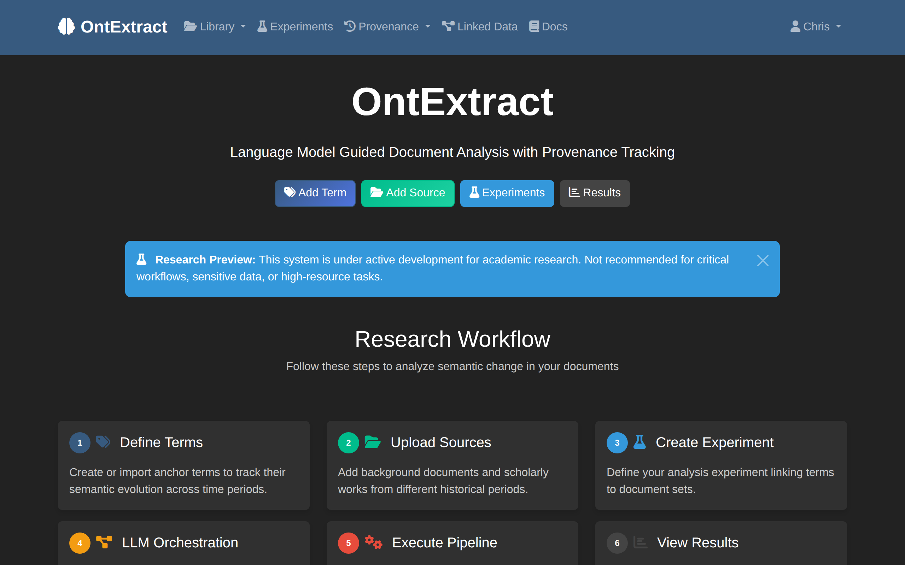

# First Login

This guide covers your first login and navigating the OntExtract interface.

## Logging In

### Docker Installation

If you used Docker, a default admin account is created automatically:

- **Username**: `admin`
- **Password**: `admin123`

Navigate to http://localhost:8765 and click **Login** in the top navigation.

### Creating a New Account

If you need to create your own account:

1. Click **Register** in the top navigation
2. Enter your username, email, and password
3. Click **Create Account**

## Interface Overview

After logging in, you'll see the home page with the research workflow.

### Main Navigation

The top navigation bar provides access to:

| Menu Item | Description |
|-----------|-------------|
| **Library** | Documents and Anchor Terms |
| **Experiments** | Your analysis experiments |
| **Linked Data** | Ontology and semantic resources |
| **Docs** | This documentation |

### Quick Action Buttons

The home page displays quick action buttons:

- **Add Term** - Create a new anchor term
- **Add Source** - Upload a document
- **Experiments** - View or create experiments
- **Results** - Access analysis results

### Research Workflow

The 6-step workflow cards guide you through the analysis process:

1. **Define Terms** - Create anchor terms to track
2. **Upload Sources** - Add documents from different periods
3. **Create Experiment** - Link terms to documents
4. **LLM Orchestration** - AI suggests processing strategies
5. **Execute Pipeline** - Process documents with selected tools
6. **View Results** - Explore findings and provenance

## Operational Modes

OntExtract operates in two modes depending on your configuration:

### Standalone Mode

Available without any API keys. Features include:

- Manual tool selection
- Entity extraction (spaCy)
- Temporal analysis (NLTK)
- Text segmentation
- Embedding generation (sentence-transformers)
- PROV-O provenance tracking

### API-Enhanced Mode

Enabled when an Anthropic API key is configured. Additional features:

- LLM-powered tool recommendations
- Automated document analysis
- Cross-document synthesis
- LLM text cleanup for OCR errors

To enable API-enhanced mode, add your API key in Settings or via environment variable.

## Recommended First Steps

### 1. Explore the Sample Experiment

If available, browse the pre-loaded "Agent Temporal Evolution" experiment to see:

- How documents are organized by period
- Processing artifacts generated
- Provenance tracking in action

### 2. Upload a Test Document

1. Click **Add Source** or navigate to **Library** > **Documents**
2. Upload a PDF or text file
3. Review the automatic metadata extraction

### 3. Create an Anchor Term

1. Navigate to **Library** > **Anchor Terms**
2. Click **Add New Anchor Term**
3. Enter a term like "agent" or "intelligence"
4. Assign a domain (e.g., "Artificial Intelligence")

### 4. Create Your First Experiment

1. Go to **Experiments** > **New Experiment**
2. Enter a name and description
3. Select documents to include
4. Choose your anchor terms
5. Save and start processing

## Getting Help

- **Documentation**: Click **Docs** in the navigation
- **FAQ**: Check the [FAQ](../faq.md) for common questions
- **Issues**: Report problems on [GitHub](https://github.com/MatLab-Research/OntExtract/issues)

## Next Steps

- [Create Anchor Terms](../how-to/create-anchor-terms.md)
- [Upload Documents](../how-to/upload-documents.md)
- [Create Temporal Experiment](../how-to/create-temporal-experiment.md)
