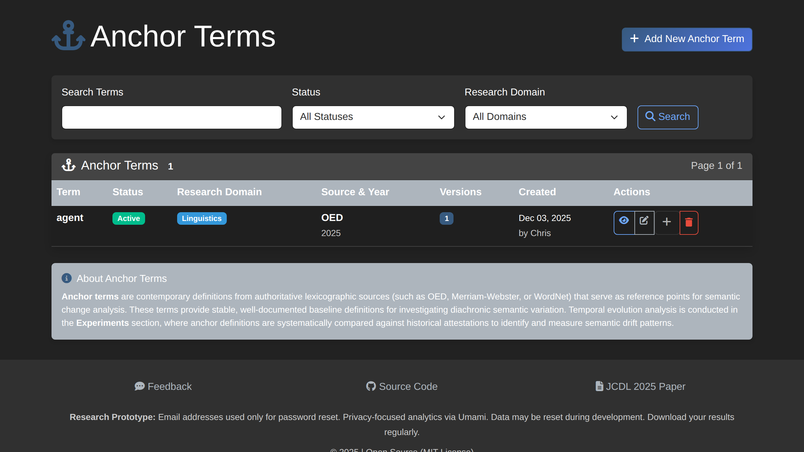

# How to Create Anchor Terms

This guide explains how to create and manage anchor terms for tracking semantic evolution.

## What Are Anchor Terms?

Anchor terms are the key concepts you want to track across historical periods. They serve as reference points for analyzing how meanings change over time.

**Examples:**
- "agent" in AI/philosophy contexts
- "machine" in industrial/computing contexts
- "intelligence" across cognitive science literature

## Creating an Anchor Term

### Step 1: Navigate to Anchor Terms

1. Click **Anchor Terms** in the main navigation
2. Click **Add New Anchor Term**

### Step 2: Basic Information

Fill in the term details:

| Field | Description | Example |
|-------|-------------|---------|
| **Term Text** | The word or phrase to track | "agent" |
| **Domain** | Subject area | "Artificial Intelligence" |
| **Part of Speech** | Grammatical category | noun, verb, adjective |
| **Status** | Current state | draft, active, archived |
| **Notes** | Additional context | "Focus on autonomous agent concept" |

### Step 3: Save the Term

Click **Create Term** to save. The term is now available for:
- Association with experiments
- Temporal version tracking
- Cross-document analysis

## Term Versions (Coming Soon)

Anchor terms support temporal versioning to capture meaning changes:

- **Temporal Period** - The time range this definition applies to
- **Meaning Description** - How the term was understood in that period
- **Context Anchors** - Representative text passages

> Note: Term versioning workflow is planned for post-JCDL release.

## Associating Terms with Experiments

### During Experiment Creation

1. When creating a new experiment, select existing anchor terms
2. Or create new terms inline

### After Experiment Creation

1. Go to **Experiments** > Select experiment
2. Navigate to **Anchor Terms** tab
3. Click **Add Term** to associate existing terms
4. Or **Create New Term** for new concepts

## Best Practices

### Choosing Terms

- **Specificity**: Choose terms specific enough to track meaningfully
- **Frequency**: Select terms that appear across your document corpus
- **Evolution potential**: Pick terms likely to show semantic change

### Term Naming

- Use the canonical/base form (e.g., "agent" not "agents")
- Be consistent with capitalization
- Include phrases if tracking multi-word concepts ("artificial intelligence")

### Domain Classification

Assign appropriate domains to help organize terms:
- Philosophy
- Computer Science
- Artificial Intelligence
- Cognitive Science
- (Custom domains as needed)

## Viewing Term Details

Click any term to see:

- **Basic Information** - Term text, domain, status
- **Temporal Versions** - Historical meaning snapshots
- **Associated Experiments** - Where the term is used
- **Context Anchors** - Source text references

## Editing Terms

1. Navigate to the term detail page
2. Click **Edit Term**
3. Modify fields as needed
4. Click **Save Changes**

> Note: Editing a term affects all experiments using it.

## Deleting Terms

Terms can only be deleted by administrators and only if:
- Not associated with any active experiments
- No temporal versions exist

To archive instead of delete:
1. Edit the term
2. Change status to **Archived**
3. Save changes

## Term Search

Find existing terms using:

- **Search box** - Search by term text
- **Domain filter** - Filter by subject area
- **Status filter** - Show active, draft, or archived

## Related Guides

- [Upload Documents](upload-documents.md)
- [Process Documents](document-processing.md)
- [Create Temporal Experiment](create-temporal-experiment.md)
