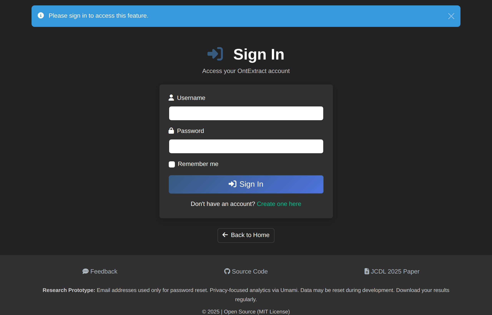
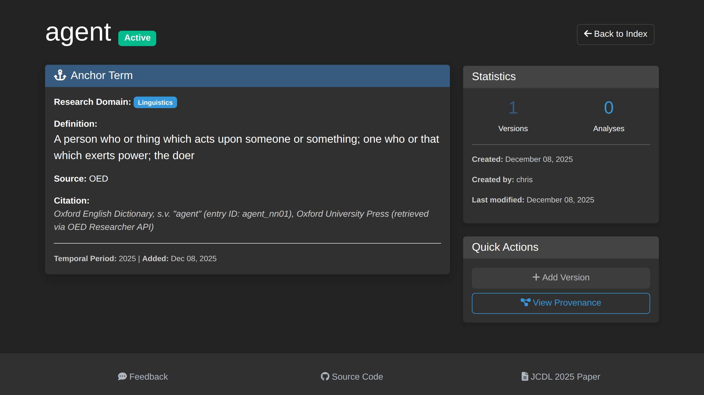

# How to Create Anchor Terms

This guide explains how to create and manage anchor terms for tracking semantic evolution.

## What Are Anchor Terms?

Anchor terms are the key concepts you want to track across historical periods. They serve as current/modern reference points—"mile markers"—for where your semantic change analysis begins.

**Examples:**
- "agent" in AI/philosophy contexts
- "machine" in industrial/computing contexts
- "intelligence" across cognitive science literature

## Creating an Anchor Term

OntExtract offers two ways to create anchor terms: using **Connected Services** (recommended) or **Manual Entry**.

### Method 1: Connected Services (Recommended)

Use authoritative lexicographic sources to establish well-documented anchor terms.

1. Navigate to **Library → Terms** and click **Add New Anchor Term**
2. Select a service to search:

| Service | Description |
|---------|-------------|
| **Merriam-Webster Dictionary** | Authoritative American English definitions |
| **Merriam-Webster Thesaurus** | Synonyms and antonyms for context anchoring |
| **Oxford English Dictionary** | Historical English definitions with temporal data |
| **WordNet** | Lexical database with semantic relationships |

3. Enter your search term when prompted
4. Browse the results and click **Use This Definition**
5. The form auto-populates with:
   - Term text
   - Meaning description
   - Context anchors (related terms)
   - Source citation
6. Add a **Research Domain** if desired
7. Click **Create Term**

### Method 2: Manual Entry

For terms not found in dictionaries or from custom sources:

1. Click the **Manual Entry** tab
2. Fill in the term details:

| Field | Description | Example |
|-------|-------------|---------|
| **Term Text** | The word or phrase to track | "agent" |
| **Source Type** | Type of reference source | Corpus, Dictionary, Standard |
| **Meaning Description** | Current baseline meaning | "An entity that acts autonomously..." |
| **Context Anchors** | Related terms (comma-separated) | "autonomous, actor, entity" |
| **Corpus Source** | Lexicographic source name | "Merriam-Webster" |
| **Source Citation** | Full citation for provenance | "Merriam-Webster Dictionary, 2024" |
| **Research Domain** | Subject area | "Artificial Intelligence" |
| **Notes** | Additional context | "Focus on autonomous agent concept" |

3. Click **Create Term**

### Context Anchors

Context anchors are related terms that help define the semantic space around your anchor term. You can:

- Let services auto-populate them from definitions
- Click the **Thesaurus** button to find synonyms
- Enter them manually (comma-separated)

## Term Versions

Anchor terms support temporal versioning to capture meaning changes over time. Versions are created through:

- **OED Temporal Timeline** - Select historical waypoints showing when new senses emerged
- **Manual versioning** - Add versions with different temporal periods

## Associating Terms with Experiments

### During Experiment Creation

1. When creating a new experiment, select existing anchor terms
2. Or create new terms inline

### After Experiment Creation

1. Go to **Experiments** > Select experiment
2. Navigate to **Anchor Terms** tab
3. Click **Add Term** to associate existing terms
4. Or **Create New Term** for new concepts

## Best Practices

### Choosing Terms

- **Specificity**: Choose terms specific enough to track meaningfully
- **Frequency**: Select terms that appear across your document corpus
- **Evolution potential**: Pick terms likely to show semantic change

### Term Naming

- Use the canonical/base form (e.g., "agent" not "agents")
- Be consistent with capitalization
- Include phrases if tracking multi-word concepts ("artificial intelligence")

### Domain Classification

Assign appropriate domains to help organize terms:
- Philosophy
- Computer Science
- Artificial Intelligence
- Cognitive Science
- (Custom domains as needed)

## Viewing Term Details

Click any term to see:

- **Basic Information** - Term text, meaning description, research domain
- **Source Information** - Corpus source and citation
- **Context Anchors** - Related terms for semantic anchoring
- **Temporal Versions** - Historical meaning snapshots (if created)
- **Associated Experiments** - Where the term is used

## Editing Terms

1. Navigate to the term detail page
2. Click **Edit Term**
3. Modify fields as needed
4. Click **Save Changes**

> Note: Editing a term affects all experiments using it.

## Deleting Terms

To delete a term:

1. Navigate to the term detail page
2. Click **Delete Term**
3. Confirm the deletion

> **Note**: Terms associated with experiments should be removed from those experiments first.

## Term Search

Find existing terms using:

- **Search box** - Search by term text
- **Domain filter** - Filter by research domain

## Related Guides

- [Upload Documents](upload-documents.md)
- [Process Documents](document-processing.md)
- [Create Temporal Experiment](create-temporal-experiment.md)
