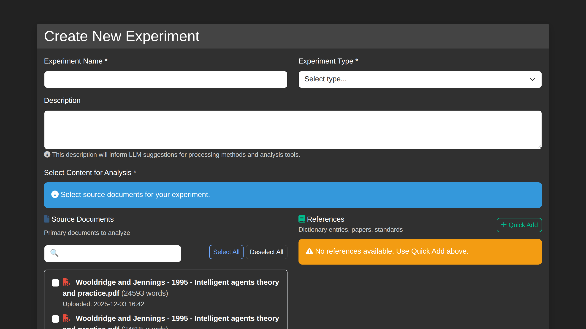

# How to Create a Temporal Evolution Experiment

Complete guide for setting up experiments to track semantic change across historical periods.

## Overview

Temporal evolution experiments analyze how term meanings change over time. By combining historical documents with anchor terms, OntExtract identifies and visualizes semantic shifts across defined time periods.

## Prerequisites

Before creating an experiment:

- [ ] OntExtract installed and running
- [ ] User account created and logged in
- [ ] Historical documents ready for upload (spanning your target time range)
- [ ] Anchor terms identified (concepts you want to track)

## Step 1: Create the Experiment

### Navigate to Experiments

1. Click **Experiments** in the main navigation
2. Click **New Experiment**

### Fill in Experiment Details

| Field | Description | Example |
|-------|-------------|---------|
| **Name** | Descriptive experiment name | "Agent Temporal Evolution 1910-2024" |
| **Description** | Research goals and scope | "Tracking the semantic evolution of 'agent' in AI literature" |
| **Start Year** | Beginning of time range | 1910 |
| **End Year** | End of time range | 2024 |
| **Status** | Experiment state | draft, active, completed |

### Temporal Periods

OntExtract automatically generates temporal periods based on your date range. You can:

- **Auto-generate** - System creates periods based on document dates
- **Manual** - Define custom period boundaries

Click **Create Experiment** to save.

## Manage Temporal Terms

After creating a temporal evolution experiment, access the **Manage Temporal Terms** feature to configure your timeline in detail.

### Accessing the Manager

1. Go to your experiment's detail page
2. Click **Manage Temporal Terms** button

### Timeline Configuration

The Temporal Term Manager provides two ways to set up periods:

| Method | Description |
|--------|-------------|
| **Auto-generate from documents** | Creates artifact markers for each document's publication year |
| **Manual Entry** | Manually specify time period boundaries |

### Adding Semantic Events

You can annotate your timeline with semantic change events:

1. Click **Add Event** in the Periods & Events section
2. Select the event type (e.g., amelioration, pejoration, drift)
3. Specify the time range (from/to periods)
4. Add a description of the semantic shift
5. Link related documents as evidence

### Period Cards

The timeline displays period cards showing:

- **Year** - The period's date marker
- **Source badge** - ARTIFACT (auto-generated) or MANUAL
- **Documents** - Papers associated with that period
- **Events** - Semantic change events spanning periods

Period boundaries are color-coded:

- **Green (START)** - Beginning of a defined period
- **Red (END)** - End of a defined period

### Saving Configuration

Click **Save Configuration** to persist your temporal setup before proceeding to analysis.

## Step 2: Add Documents

### Option A: Upload New Documents

1. Go to your experiment's **Document Pipeline**
2. Click **Add Documents**
3. Upload files or select from existing documents
4. Ensure each document has a **publication date** for period assignment

### Option B: Associate Existing Documents

1. From **Document Pipeline**, click **Add Existing**
2. Search and select documents from your library
3. Documents are assigned to periods based on publication date

### Document Requirements

For meaningful temporal analysis:

- **Multiple documents per period** - More data improves accuracy
- **Date coverage** - Documents spanning your full time range
- **Consistent domain** - Documents from related subject areas

See [Upload Documents](upload-documents.md) for detailed upload instructions.

## Step 3: Process Documents

### LLM Text Cleanup (Recommended)

For scanned or OCR'd documents:

1. In **Document Pipeline**, click the broom icon for each document
2. Review suggested corrections
3. Accept or modify changes
4. Save cleaned version

### Run Processing Operations

From the **Document Pipeline** or individual document pages:

1. **Segmentation** - Split into paragraphs/sentences
2. **Embeddings** - Generate vector representations
3. **Entity Extraction** - Identify named entities

Use **Run Local Tools** for batch processing without API costs.

## Step 4: Create Anchor Terms

### Add Terms to Track

1. Navigate to **Anchor Terms**
2. Click **Add New Anchor Term**
3. Enter:
   - **Term text** - The word/phrase to track (e.g., "agent")
   - **Domain** - Subject area
   - **Notes** - Research context

### Associate with Experiment

1. Return to your experiment
2. Go to **Anchor Terms** section
3. Link your terms to the experiment

See [Create Anchor Terms](create-anchor-terms.md) for detailed instructions.

## Step 5: Run Analysis

### LLM Orchestration (Advanced)

For AI-assisted analysis:

1. Go to experiment's **LLM Orchestration** tab
2. Click **Start Analysis**
3. Review the generated strategy
4. Approve or modify the approach
5. Execute the analysis

### Manual Analysis

Explore results through:

- **Timeline View** - Visual evolution across periods
- **Document Comparison** - Side-by-side period analysis
- **Term Context** - Source passages for each period

## Step 6: Review Results

### Timeline Visualization

The timeline shows:
- Term usage frequency per period
- Semantic change events
- Context snippets from source documents

### Export Options

Export your analysis:
- **CSV** - Tabular data
- **JSON** - Structured results
- **Report** - Formatted summary

## Example: "Agent" Evolution Study

### Setup

- **Time range**: 1910-2024
- **Documents**: 7 historical papers on agents/agency
- **Anchor term**: "agent"

### Documents by Period

| Period | Document | Year |
|--------|----------|------|
| 1910-1920 | "Pragmatism and Humanism" (Schiller) | 1910 |
| 1940-1960 | "Outline of a Theory of Practice" (Bourdieu) | 1956 |
| 1980-1990 | "Situated Actions" (Suchman) | 1987 |
| 1990-2000 | "Agent Theories" (Wooldridge) | 1995 |
| 2000-2010 | "Cognitive Architectures" (Anderson) | 2007 |
| 2010-2020 | "Deep Learning" (LeCun) | 2015 |
| 2020-2024 | "Foundation Models" (Bommasani) | 2021 |

### Observed Evolution

The term "agent" shifts from:
- **1910s**: Philosophical/human agency
- **1980s**: Situated human actors
- **1990s**: Computational autonomous entities
- **2020s**: AI systems with emergent capabilities

## Tips for Success

### Document Selection

- Cover your full time range
- Include seminal/influential works
- Maintain domain consistency

### Period Definition

- Match periods to historical phases
- Ensure sufficient documents per period
- Consider publication clustering

### Term Selection

- Choose terms with evolution potential
- Avoid overly common words
- Include domain-specific terminology

## Troubleshooting

### No Documents in Period

- Check document publication dates
- Verify period boundaries
- Upload additional documents for sparse periods

### Processing Errors

- Ensure documents have text content
- Run LLM cleanup on problematic documents
- Check API keys for external services

### Missing Analysis Results

- Verify all processing steps completed
- Check anchor term associations
- Review experiment status

## Related Guides

- [Upload Documents](upload-documents.md)
- [Process Documents](document-processing.md)
- [Create Anchor Terms](create-anchor-terms.md)
