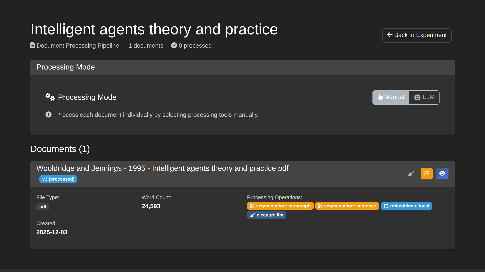

# How to Process Documents

This guide covers the document processing operations available in OntExtract.

## Overview

After uploading documents, you can apply various processing operations to extract structured information. OntExtract preserves original documents unchanged—all results are stored as ProcessingArtifacts linked to source documents through PROV-O relationships.

## Processing Operations

| Operation | Purpose | Mode |
|-----------|---------|------|
| **LLM Text Cleanup** | Fix OCR errors, normalize spelling | API-enhanced |
| **Segmentation** | Split into paragraphs or sentences | Standalone |
| **Embeddings** | Generate vector representations | Both |
| **Entity Extraction** | Identify people, places, organizations | Standalone |
| **Temporal Extraction** | Find dates, periods, durations | Standalone |
| **Definition Extraction** | Locate concept definitions | Standalone |

## LLM Text Cleanup

Use this for scanned or OCR'd historical documents with recognition errors.

### When to Use

- Documents with OCR character errors (rn → m, l → I)
- Archaic spelling that needs normalization
- Scanning artifacts (headers, page numbers in text)

### How to Run

1. Navigate to your document's detail page
2. Find the **Content** card
3. Click **Clean Text with LLM**
4. Review the suggested corrections
5. Accept or modify changes
6. Save the cleaned version

**Note**: LLM cleanup creates a new document version. The original is preserved. This operation requires an Anthropic API key configured in settings.

### From Document Pipeline

You can also trigger cleanup from the experiment's Document Pipeline:

1. Go to **Experiments** > Select experiment > **Document Pipeline**
2. Click the broom icon next to any document
3. Follow the cleanup workflow

## Segmentation

Split documents into logical sections for analysis.

### Segmentation Methods

| Method | Description | Best For |
|--------|-------------|----------|
| **Paragraph** | Regex-based natural boundaries | Most documents |
| **Sentence** | NLTK tokenizer splitting | Fine-grained analysis |
| **Semantic** | Sentence-transformers topic grouping | Complex documents |

### How to Run

1. Go to your document or experiment's **Document Pipeline**
2. Select documents to process
3. Check **Segmentation** in Processing Operations
4. Choose your segmentation method
5. Click **Run Selected Operations**

### Results

Segmentation creates TextSegment artifacts with:
- Segment text content
- Character-level position (start/end offsets)
- Segment index within document

## Embedding Generation

Create vector representations for semantic similarity search.

### Embedding Methods

| Method | Description | Best For |
|--------|-------------|----------|
| **Local** | Standard sentence-transformers model | General modern text |
| **Period Aware** | Selects model based on document era/domain | Historical or domain-specific text |
| **OpenAI** | text-embedding-ada-002 | High accuracy (requires API key) |

### How to Run

1. Go to **Document Pipeline** or document detail
2. Check **Embeddings** in Processing Operations
3. Select embedding method
4. Click **Run Selected Operations**

### Period-Aware Embeddings

For historical documents or specialized domains, use **Period Aware** embeddings. This automatically selects appropriate models based on:

- Document publication date
- Domain (scientific, legal, biomedical)
- Detected archaic language patterns

See [Period-Aware Embeddings](period-aware-embeddings.md) for detailed information.

### Results

Embeddings enable:
- Semantic similarity search across segments
- Finding related passages across documents
- Clustering similar content

Vectors are stored in PostgreSQL using pgvector for efficient similarity queries.

## Entity Extraction

Identify named entities using spaCy NLP models.

### Entity Types

- **PERSON** - People, including fictional
- **ORG** - Organizations, companies, agencies
- **GPE** - Geopolitical entities (countries, cities)
- **DATE** - Dates and periods
- **WORK_OF_ART** - Titles of works

### How to Run

1. Select documents in Document Pipeline
2. Check **Entity Extraction** in Processing Operations
3. Click **Run Selected Operations**

### Results

Entity extraction creates artifacts with:
- Entity text and type
- Character positions in source
- Confidence scores

**Note**: Accuracy depends on domain alignment with training corpora. Historical and technical texts may require validation.

## Definition Extraction

Extract term definitions using hybrid zero-shot classification and pattern matching.

### Approach

OntExtract uses a multi-method approach combining:

1. **Zero-shot classification** (`facebook/bart-large-mnli`)
   - Scores sentences for definition likelihood
   - Used for confidence boosting, not filtering
   - Zero-shot can misclassify some definition sentences, so all patterns are checked

2. **Pattern matching** - Detects 8 definition types:
   - **explicit_definition**: "X is defined as Y"
   - **explicit_reference**: "X refers to Y"
   - **meaning**: "X means Y"
   - **copula**: "X is a Y"
   - **acronym**: "IRA (Information Retrieval Agent)" with strict validation
   - **also_known_as**: "X (also known as Y)"
   - **ie_explanation**: "X (i.e., Y)"
   - **appositive**: Dependency parsing for noun appositives

3. **Strict acronym validation**:
   - Pattern: 2-6 uppercase letters with capitalized word expansion
   - Requires expansion first letters to match acronym (e.g., "IRA" must expand to words starting with I, R, A)
   - Rejects expansions containing years (likely citations)
   - Eliminates nonsense patterns

4. **Quality filters**:
   - Reject academic citations (e.g., "et al., 2015")
   - Reject reference lists (year ranges, multiple years)
   - Reject terms with more than 3 words
   - Length validation (10-200 characters)

### How to Run

1. Select documents in Document Pipeline
2. Check **Definition Extraction** in Processing Operations
3. Click **Run Selected Operations**

### Results

Definition extraction creates artifacts with:
- Term being defined
- Definition text
- Pattern type (explicit, acronym, etc.)
- Confidence score (0.65-0.90 depending on pattern)
- Character positions in source document
- Source sentence for context

Results are labeled "Auto" in the UI with source badges showing "ZeroShot" or "Pattern".

## Batch Processing

Process multiple documents efficiently:

1. Go to **Experiments** > Select experiment > **Document Pipeline**
2. Use checkboxes to select multiple documents
3. Choose operations to apply
4. Click **Run Selected Operations**

Operations run in parallel where possible. Progress is tracked in the interface.

## Processing Without API Costs

**Run Local Tools** processes documents using only local NLP libraries:
- spaCy for entity extraction
- NLTK for sentence tokenization
- sentence-transformers for embeddings

No external API calls are made, enabling offline operation.

## Viewing Results

After processing:

1. Go to the document detail page
2. Click **Processing Artifacts** tab
3. View artifacts grouped by operation type
4. Click any artifact to see details

### Artifact Details

Each artifact shows:
- Operation type and timestamp
- Source document reference
- Processing parameters
- Structured results

## PROV-O Provenance

All processing operations create PROV-O provenance records:

- **wasDerivedFrom** - Links artifacts to source documents
- **wasGeneratedBy** - Connects artifacts to generating activities
- **wasAssociatedWith** - Maps operations to tool versions

This enables complete reproducibility—you can trace any result back to its source and understand exactly how it was generated.

## Troubleshooting

### Processing Stuck

- Check Celery worker status
- Verify Redis connection
- Review application logs

### No Results Generated

- Ensure document has text content
- Check that source document exists
- Verify processing completed (no errors in logs)

### Embedding Errors

- For OpenAI: verify API key in settings
- For local: check sentence-transformers installation
- Ensure document has been segmented first

## Related Guides

- [Upload Documents](upload-documents.md)
- [Create Temporal Experiment](create-temporal-experiment.md)
- [Create Anchor Terms](create-anchor-terms.md)
