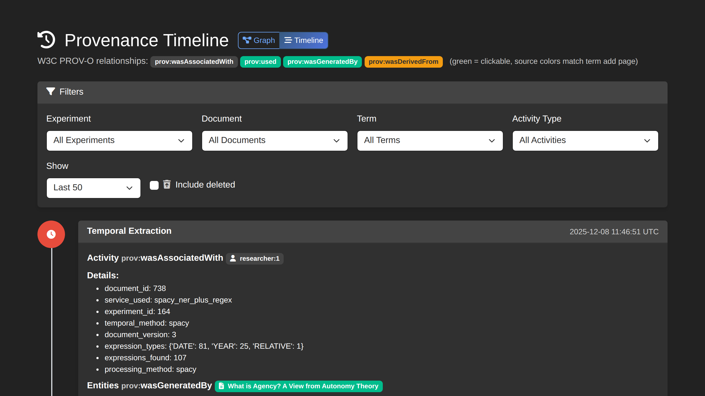

# How to Use Provenance Tracking

This guide covers OntExtract's PROV-O provenance tracking features.

## Overview

OntExtract implements W3C PROV-O provenance tracking directly in the database schema. Every processing operation creates versioned outputs with corresponding provenance records, enabling complete reproducibility of analytical workflows.

## Why Provenance Matters

- **Reproducibility** - Recreate exact processing conditions
- **Transparency** - Understand how results were generated
- **Debugging** - Trace unexpected results to their source
- **Scholarly citation** - Document analytical methodology

## PROV-O Concepts

OntExtract uses the PROV-O entity-activity-agent model:

| Concept | Description | Examples in OntExtract |
|---------|-------------|------------------------|
| **Entity** | Artifacts created or modified | Documents, text segments, extracted entities |
| **Activity** | Processes that generate entities | Segmentation, entity extraction, embedding generation |
| **Agent** | Actors responsible for activities | Users, NLP tools (spaCy 3.8.11), LLM orchestrator |

### PROV-O Relationships

Four relationships enable workflow reconstruction:

| Relationship | Meaning | Example |
|--------------|---------|---------|
| `wasDerivedFrom` | Links artifacts to source documents | Text segment derived from uploaded PDF |
| `wasGeneratedBy` | Connects artifacts to generating processes | Entities generated by extraction activity |
| `used` | Records which entities were consumed | Segmentation used the original document |
| `wasAssociatedWith` | Maps operations to tool versions | Extraction associated with spaCy 3.8.11 |

## Provenance Timeline

Access the provenance timeline at **Provenance** > **Timeline** to view a chronological audit trail of all activities.

### Filtering the Timeline

Filter provenance records by:

- **Experiment** - Show only activities for a specific experiment
- **Document** - Show activities related to a document family
- **Term** - Filter by anchor term
- **Activity type** - Filter by operation type

### Activity Types

| Activity Type | Description |
|---------------|-------------|
| `document_upload` | Initial document upload |
| `text_extraction` | Text extracted from PDF/document |
| `document_segmentation` | Document split into segments |
| `embedding_generation` | Vector embeddings created |
| `entity_extraction` | Named entities identified |
| `temporal_extraction` | Dates and periods extracted |
| `definition_extraction` | Concept definitions located |
| `orchestration_run` | LLM orchestration workflow |
| `tool_execution` | Individual tool execution |

## Document Versioning

OntExtract preserves original documents unchanged. Processing creates new document versions linked through provenance.

### Version Types

| Type | Description |
|------|-------------|
| `original` | The initially uploaded document (v1) |
| `processed` | Result of processing operations |
| `experimental` | Created within an experiment context |
| `composite` | Merged or combined from multiple sources |

### Document Selection in Experiments

When creating new experiments, only **original (v1) documents** appear in the selection dropdown. This ensures experiments start with clean source materials. To use a processed version, reference the original experiment that created it.

### Document Selection in Provenance

When filtering the provenance timeline by document:

1. Only **original documents** appear in the dropdown
2. Selecting a document shows provenance for the **entire document family** (all versions)
3. A hint displays: "Showing provenance for X versions" when multiple versions exist

This design enables tracing complete processing history from a single selection.

## Processing Artifacts

Analysis results are stored as **ProcessingArtifacts** - separate database entities linked to source documents through PROV-O relationships. This maintains document integrity and enables applying multiple processing strategies to identical sources.

### Artifact Contents

Each ProcessingArtifact includes:

- **Operation type** - What processing was performed
- **Timestamps** - When the operation occurred
- **Configuration parameters** - Settings used
- **Results** - Structured output data
- **Character positions** - For text-based artifacts

### Viewing Artifact Provenance

Provenance information is accessible through the **Provenance** > **Timeline** view:

1. Filter by document to see all processing history
2. Each activity shows its provenance chain:
   - Source document (`wasDerivedFrom`)
   - Generating activity (`wasGeneratedBy`)
   - Tool and version (`wasAssociatedWith`)

## Reproducibility Features

### Deterministic Operations

Document processing operations (segmentation, extraction) produce identical outputs given:

- Identical input documents
- Same tool versions
- Same configuration parameters

### Non-Deterministic Operations

LLM orchestration recommendations vary across runs due to model non-determinism. However, the system records:

- Complete decision context
- Recommendations and confidence scores
- Human review decisions
- Execution parameters

### Settings Capture

Experiments capture their complete configuration state at creation time, including:

- Model selections (spaCy model, embedding model)
- Processing method parameters
- Output dimensions
- Similarity thresholds

## Exporting Provenance

Export provenance records for external analysis:

- **JSON** - Structured PROV-O compatible format
- **Timeline view** - Chronological audit trail

## Related Guides

- [Process Documents](document-processing.md)
- [View Results](view-results.md)
- [LLM Orchestration](llm-orchestration.md)
