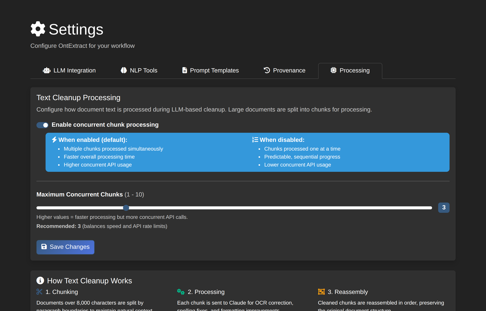

# Settings

OntExtract provides configurable settings to customize application behavior. Access settings via **Settings** in the navigation menu (admin users only).

## Settings Categories

### LLM Integration

Controls LLM-assisted features like template enhancement.

| Setting | Type | Default | Description |
|---------|------|---------|-------------|
| Enable LLM Enhancement | Boolean | On | Enable LLM template enhancement for experiment descriptions |
| Max Tokens | Integer | 200 | Maximum response length for template enhancement (50-1000) |

!!! note "API Key Required"
    LLM features require the `ANTHROPIC_API_KEY` environment variable to be set.

### NLP Tools

Configure the transformer-based definition extraction tool.

| Setting | Type | Default | Description |
|---------|------|---------|-------------|
| Confidence Threshold | Float | 0.70 | Minimum confidence for definition extraction (0.5-0.95). Higher = fewer but more accurate results |

### Prompt Templates

Manage Jinja2 templates for experiment descriptions. Templates can be viewed and edited, with optional LLM enhancement support.

| Column | Description |
|--------|-------------|
| **Template** | Template key identifier |
| **Category** | Template category (e.g., experiment descriptions) |
| **Variables** | Required template variables |
| **LLM Enhancement** | Whether LLM can enhance template output |
| **Actions** | View or edit the template |

### Processing

Configure how documents are processed during text cleanup operations.

| Setting | Type | Default | Description |
|---------|------|---------|-------------|
| Concurrent Chunk Processing | Boolean | On | Process document chunks in parallel for faster cleanup |
| Max Concurrent Chunks | Integer | 3 | Maximum simultaneous API calls (1-10) |

#### How Text Cleanup Works

When cleaning large documents (>8,000 characters), OntExtract:

1. **Chunks** the document by paragraph boundaries
2. **Processes** each chunk through Claude for OCR correction, spelling fixes, and formatting improvements
3. **Reassembles** cleaned chunks in order

**Parallel Mode** (default): Multiple chunks processed simultaneously. Faster overall but uses more concurrent API calls.

**Sequential Mode**: Chunks processed one at a time. Predictable progress, lower concurrent API usage.

!!! tip "Recommended Settings"
    The default of 3 concurrent chunks balances speed with API rate limits. Increase to 5-10 for faster processing with higher rate limits.

### Provenance

Configure how provenance records are handled during deletions.

| Setting | Type | Default | Description |
|---------|------|---------|-------------|
| Purge on Delete | Boolean | On | Permanently delete provenance records (vs. mark as invalidated) |
| Show Deleted in Timeline | Boolean | Off | Display invalidated items in timeline views by default |

When **Purge on Delete** is disabled:
- Provenance records are marked as "invalidated" but preserved
- Complete audit trail is maintained
- Deleted items can be shown in timeline views

## Saving Settings

1. Navigate to the **Settings** page
2. Select the appropriate tab (LLM Integration, NLP Tools, Prompt Templates, Provenance, or Processing)
3. Modify settings as needed
4. Click **Save Changes**

Settings are stored per-user, allowing different users to have different preferences.

## Related Guides

- [LLM Orchestration](llm-orchestration.md) - Using LLM-powered document analysis
- [Process Documents](document-processing.md) - Text cleanup and processing
- [Provenance Tracking](provenance-tracking.md) - Understanding the audit trail
