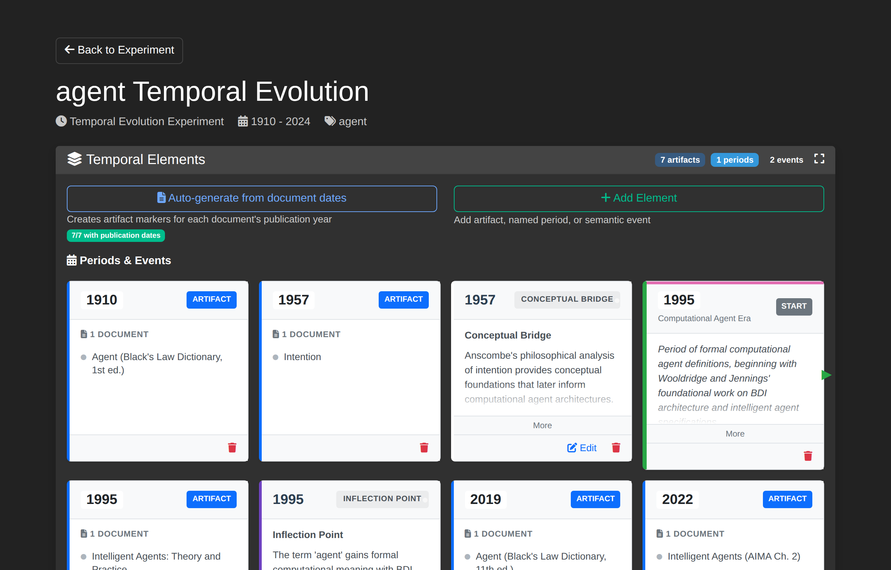
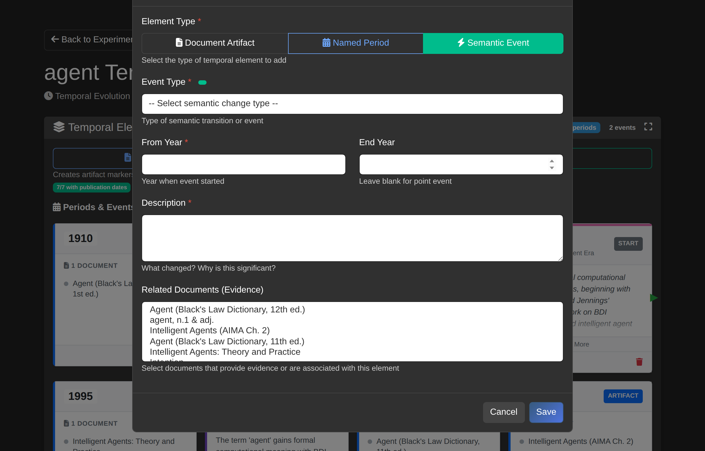
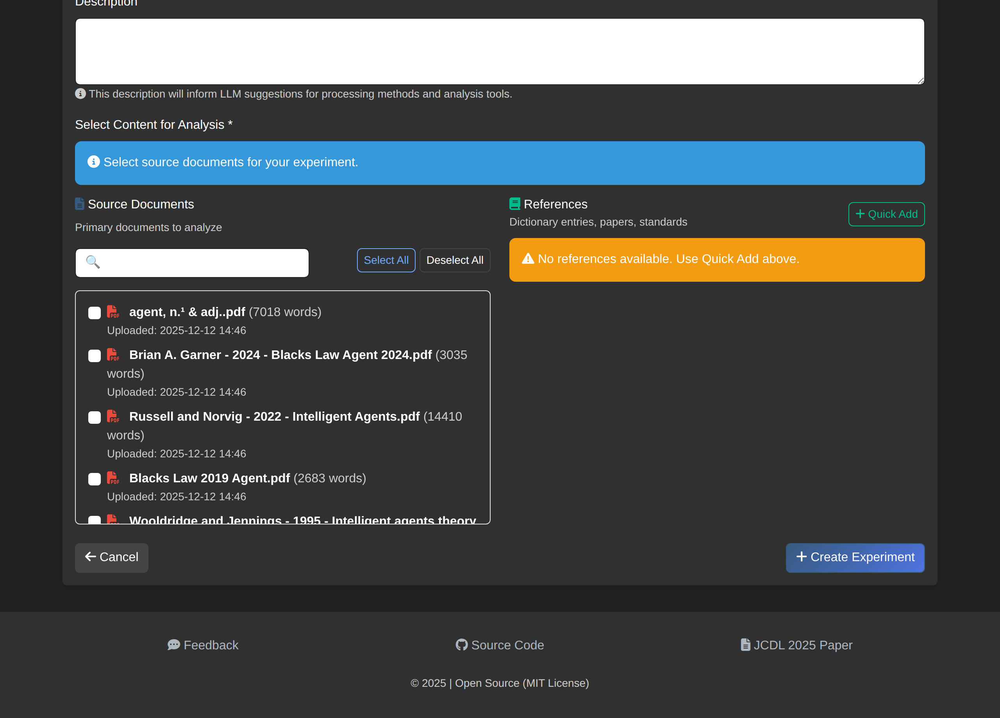

# How to Manage Temporal Terms

Configure time periods, document artifacts, and semantic events for temporal evolution experiments.

## Overview

The Temporal Term Manager provides tools to analyze how term meanings change over time. It combines document-based analysis with Oxford English Dictionary (OED) historical data to track semantic evolution across defined periods.

## Accessing the Manager

1. Navigate to **Experiments** and select a temporal evolution experiment
2. Click **Manage Temporal Terms** on the experiment detail page

## Interface Components

### Header Section

The header displays:

| Element | Description |
|---------|-------------|
| **Experiment name** | Title with target term (e.g., "agent Temporal Evolution") |
| **Experiment type badge** | "Temporal Evolution" indicator |
| **View Timeline** | Opens the timeline visualization |
| **Back to Experiment** | Returns to experiment detail page |

### Temporal Elements Section

This section manages all timeline markers:

- **Auto-generate from documents** - Creates artifact markers from document publication dates
- **Add** button - Opens the unified element creation modal
- **Periods & Events grid** - Displays all temporal elements on a timeline

## Adding Temporal Elements

Click the **Add** button to open the unified "Add Temporal Element" modal with three element types:

### Document Artifact

Marks a specific year with an associated document reference.

| Field | Description |
|-------|-------------|
| **Year** | Publication or reference year |
| **Name** | Optional label for the artifact |
| **Documents** | Select associated documents |

Use document artifacts to mark publication years or reference points on the timeline.

### Named Period

Defines a historical era or time span with semantic coherence.

| Field | Description |
|-------|-------------|
| **Period Type** | Category (e.g., "Research Era", "Legal Period") |
| **Name** | Descriptive period name (e.g., "Computational Agent Era") |
| **Start Year** | Beginning of the period |
| **End Year** | End of the period |
| **Description** | Explanation of the period's significance |

Named periods appear as colored spans on the timeline, with START and END markers.

### Semantic Event

Records a semantic change event such as meaning shift or domain transition.

| Field | Description |
|-------|-------------|
| **Event Type** | Semantic change category from ontology |
| **From Year** | Year when event started |
| **End Year** | Leave blank for point events; specify for spans |
| **Description** | What changed and why it matters |
| **Related Documents** | Evidence documents for the event |

#### Event Types

Event types are loaded from the semantic change ontology:

| Type | Definition |
|------|------------|
| **Inflection Point** | A specific moment when semantic change becomes evident |
| **Semantic Drift** | Gradual change in meaning over time |
| **Pejoration** | Meaning becomes more negative |
| **Amelioration** | Meaning becomes more positive |
| **Conceptual Bridge** | A semantic link between previously distinct concept domains |

## Auto-Generate from Documents

Click **Auto-generate from documents** to automatically create document artifact markers:

1. The system scans all experiment documents for publication dates
2. Creates an artifact marker for each unique year
3. Associates documents with their respective year markers

This provides a starting point for the timeline that can be refined with manual additions.

## Timeline Display

The Periods & Events grid shows:

- **Year columns** - Each unique year in the experiment range
- **Document count badges** - Number of documents per year
- **Period spans** - Colored bars showing named period ranges
- **Event markers** - Icons indicating semantic events
- **Source badges** - ARTIFACT (auto-generated) or MANUAL

### Period Boundary Indicators

- **START** (green) - Beginning of a named period
- **END** (red) - End of a named period

## OED Integration

For terms with OED entries, the system can suggest time periods based on historical quotation data:

1. OED quotations provide earliest attested uses
2. Year ranges indicate when meanings were active
3. 5-year period intervals are generated from quotation years

OED period data appears in the configuration alongside document-based periods.

## Saving Configuration

Changes auto-save when you:

- Add or modify temporal elements
- Update period boundaries
- Link documents to events

The configuration is stored in the experiment's JSON configuration field.

## Workflow Example

A typical workflow for analyzing "agent" across 1910-2024:

1. **Auto-generate** periods from document dates
2. **Add named period** - "Computational Agent Era (1995-2024)"
3. **Add semantic event** - Inflection Point at 1995 (Wooldridge & Jennings formalization)
4. **Add semantic event** - Conceptual Bridge at 1957 (Anscombe's philosophical groundwork)
5. **Review timeline** - Verify period coverage and event placement
6. **View Timeline** - Visualize the semantic evolution

## References (Under Development)

References are canonical source materials such as dictionary entries, academic papers, or authoritative texts that provide baseline definitions for terms being analyzed. Unlike regular documents which form the corpus for analysis, references serve as comparison points.

### Current Functionality

References can be added when creating or editing an experiment:

1. Navigate to **Experiments** and click **New Experiment** (or edit an existing one)
2. In the **Select Content for Analysis** section, find the **References** panel
3. Click **Quick Add** to add reference materials
4. Save the experiment

Once added, references appear in the experiment detail page under a dedicated "References" card, showing the reference title, source, and word count.

### Planned Features

The following capabilities are planned for future releases:

| Feature | Description |
|---------|-------------|
| **Definition comparison** | Compare extracted definitions against reference definitions |
| **Semantic drift measurement** | Quantify how document usage differs from canonical meanings |
| **Citation linking** | Link semantic events to specific reference passages |
| **Cross-reference analysis** | Track how multiple references define the same term |

Currently, references are stored with the experiment but do not yet participate in the analysis workflow. This functionality will be expanded in future releases to enable comparison between corpus usage and canonical definitions.

## Related Guides

- [Create Temporal Experiment](create-temporal-experiment.md)
- [Upload Documents](upload-documents.md)
- [View Results](view-results.md)
- [Provenance Tracking](provenance-tracking.md)
