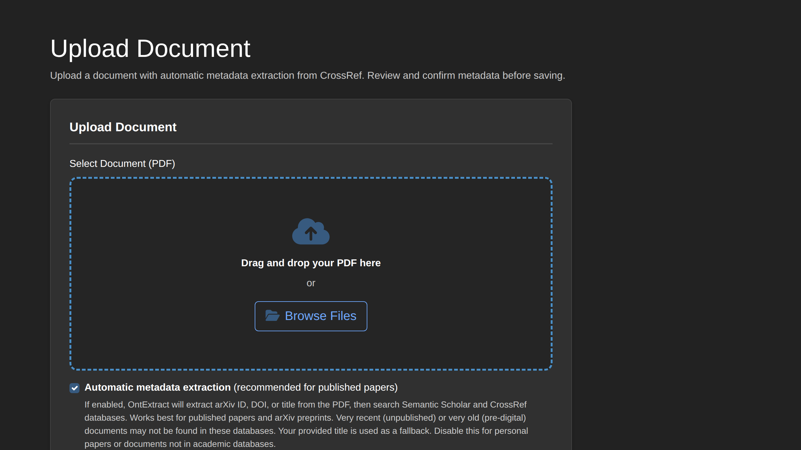

# How to Upload Documents

This guide covers uploading historical documents to OntExtract for analysis.

## Overview

Documents are the foundation of temporal evolution analysis. OntExtract supports various document formats and captures metadata essential for period-aware processing.

## Supported Formats

- **PDF** - Scanned or digital PDFs (text extracted automatically)
- **Plain Text** (.txt) - Raw text files
- **Word Documents** (.docx) - Microsoft Word format
- **HTML** (.html, .htm) - Web pages and HTML documents
- **Markdown** (.md) - Markdown-formatted text

## Document Versions

OntExtract treats each upload as a separate document record. Multiple versions of the same work can be uploaded:

- **Different formats** - PDF and Word versions of the same paper
- **Different versions** - Preprint (v1) and final published version
- **Updated copies** - A cleaner scan or OCR-corrected version

### How Versions Are Handled

- Documents with the same DOI or title are not automatically linked
- Each upload creates an independent document record
- Provenance tracking records which specific document version was processed

### Best Practices

| Scenario | Recommendation |
|----------|----------------|
| Better quality scan available | Upload new version, use it for new experiments |
| Preprint vs published | Upload both if content differs significantly |
| PDF and Word of same content | Upload whichever extracts text better |
| Duplicate by accident | Delete the unwanted copy from the Sources list |

To identify duplicates, sort by DOI or title in the Sources view.

## Upload Methods

### Single Document Upload

1. Navigate to **Library → Sources** in the main menu
2. Click **Upload Document**
3. Select or drag-and-drop your file
4. Review the extracted metadata (see below)
5. Click **Upload**

## Automatic Metadata Extraction

By default, OntExtract automatically extracts metadata from uploaded PDFs using a cascade of methods:

### Extraction Priority

1. **arXiv ID** - Checked first in filename, then PDF content. If found, queries Semantic Scholar.
2. **DOI** - Extracted from PDF pages. If found, queries Semantic Scholar, then CrossRef.
3. **Title + Authors** - Extracted from PDF text. Used to search CrossRef database.
4. **PDF embedded metadata** - Falls back to PDF document properties.
5. **Filename** - Used as last resort for title if nothing else matches.

### Database Lookups

OntExtract queries academic databases to enrich metadata:

| Database | Best For | What It Provides |
|----------|----------|------------------|
| **Semantic Scholar** | arXiv papers, recent preprints | Title, authors, year, abstract, citation count |
| **CrossRef** | Published journal articles, books | Title, authors, journal, volume, pages, DOI |

**Note**: Very recent papers (not yet indexed) or very old documents (pre-digital) may not be found in these databases.

### Source Indicators

After extraction, the upload form shows badges indicating where each metadata field originated:

- **Green** - CrossRef database match
- **Blue** - Semantic Scholar database match
- **Yellow** - Extracted from PDF analysis
- **Cyan** - User-provided value

### Disabling Automatic Extraction

Uncheck **"Automatic metadata extraction"** to:

- Skip database lookups entirely
- Reveal all manual entry fields
- Enter metadata directly without API calls

This is useful for:

- Personal or unpublished documents
- Historical documents not in academic databases
- Documents where automatic extraction produces incorrect results

## Metadata Fields

### Required Fields

| Field | Description |
|-------|-------------|
| **Title** | Document title (only required field) |

### Core Fields (Always Shown)

| Field | Description |
|-------|-------------|
| Title | Document title for identification |
| Authors | Comma-separated author names |
| Publication Date | Year, month-year, or full date |

### Extended Fields (Manual Entry Mode)

When automatic extraction is disabled, additional fields appear:

**Publication Details**:

| Field | Description |
|-------|-------------|
| Journal/Publication | Journal or publication name |
| Volume | Volume number |
| Issue | Issue number |
| Pages | Page range (e.g., "123-145") |
| Publisher | Publishing organization |
| Container Title | For chapters in edited volumes |
| Series | Book or journal series |
| Edition | Edition number or description |
| Editor | Editor name(s) |

**Identifiers**:

| Field | Description |
|-------|-------------|
| DOI | Digital Object Identifier |
| URL | Web address |
| ISBN | Book identifier |
| ISSN | Serial identifier |

**Additional Information**:

| Field | Description |
|-------|-------------|
| Abstract | Document abstract or summary |
| Document Type | Academic Paper, Book, Dictionary Entry, etc. |
| Entry Term | For dictionary/reference entries (headword) |
| Access Date | When online source was accessed |
| Notes | Additional context or comments |

### Publication Date Formats

OntExtract accepts various date formats:

- **Year only**: `1910`, `1856`
- **Month and year**: `March 1910`, `1910-03`
- **Full date**: `1910-03-15`, `March 15, 1910`

The system extracts the year for temporal period assignment.

### Planned Features

The following features are under consideration for future releases:

- **Multiple authors** with structured entry and Zotero-style lookup
- **LLM-based metadata guessing** from document content

## After Upload

Once uploaded, documents appear in **Library > Sources** accessible from the main menu.

### Processing Options

After upload, documents can be processed with:

- **LLM Text Cleanup** - Fix OCR errors, formatting issues (recommended for scanned documents)
- **Segmentation** - Split into paragraphs or sentences
- **Embeddings** - Generate vector representations for similarity search
- **Entity Extraction** - Identify named entities and concepts

## Tips for Historical Documents

### OCR Quality

Scanned historical documents often have OCR errors. Use the **LLM Text Cleanup** feature to:
- Fix character recognition mistakes (rn → m, l → I)
- Correct archaic spelling normalization
- Remove scanning artifacts (headers, page numbers)

### Temporal Periods

Documents are automatically assigned to temporal periods based on publication date. For an experiment tracking 1910-2024:
- A document from 1910 goes in the earliest period
- A document from 2020 goes in the latest period

## Troubleshooting

### Upload Fails

- Check file size (max 50MB default)
- Verify file format is supported
- Ensure you're logged in

### No Text Extracted

- PDF may be image-only (scanned without OCR)
- Try re-uploading with a different format

### Wrong Publication Date

- Edit the document metadata after upload
- Go to **Library** > **Sources** > Select document > **Edit**

## Related Guides

- [Manage Your Library](manage-library.md)
- [Process Documents](document-processing.md)
- [Create Temporal Experiment](create-temporal-experiment.md)
- [Create Anchor Terms](create-anchor-terms.md)
