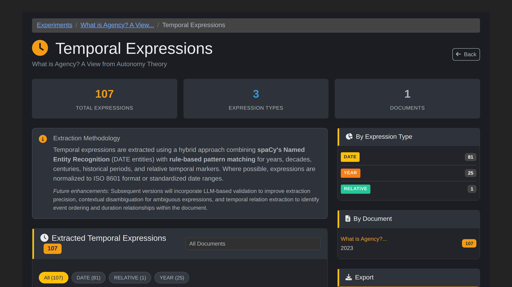

# How to View Results

This guide covers exploring analysis results and provenance in OntExtract.

## Overview

After processing documents, OntExtract provides several ways to explore results:

- Processing artifacts for individual documents
- Experiment-level analysis and timelines
- Provenance graphs showing processing history
- Export options for further analysis

## Viewing Processing Results

Processing results are accessed through experiment result pages, which aggregate findings across all documents in an experiment.

### Access Results

1. Go to **Experiments** > Select an experiment
2. Expand the **View Results** section
3. Click a result type (Definitions, Entities, Embeddings, Segments, or Temporal)

### Artifact Types

| Type | Contents |
|------|----------|
| **Text Segments** | Paragraphs or sentences with character positions |
| **Entities** | Named entities with types and confidence scores |
| **Embeddings** | Vector representations (viewable as similarity scores) |
| **Temporal Expressions** | Dates, periods, and durations found in text |
| **Definitions** | Extracted concept definitions with pattern types |

### Definition Results

Definition artifacts include:

- **Term** - The word or phrase being defined
- **Definition text** - The extracted definition content
- **Pattern type** - How it was detected (explicit_definition, explicit_reference, meaning, copula, acronym, also_known_as, ie_explanation, appositive)
- **Confidence** - Score from 0.65-0.90 depending on pattern reliability
- **Source badge** - "Pattern" (default) or "ZeroShot" (if enabled via `ENABLE_ZERO_SHOT_DEFINITIONS=true`)

Acronym definitions show strict validation: "IRA (Information Retrieval Agent)" passes because expansion letters match the acronym.

**Note**: Definition extraction works best on documents that explicitly define terminology, such as glossaries, textbook introductions, or standards documents. Research papers that use but do not define terms may return few or no results.

### Artifact Details

Each artifact shows:

- Operation type and timestamp
- Source document reference
- Processing parameters used
- Tool version (for reproducibility)
- Structured results

## Experiment Results

### Result Type Views

From the experiment page, use the **View Results** buttons to explore specific result types:

| Button | Shows |
|--------|-------|
| **Definitions** | Extracted term definitions across all documents |
| **Entities** | Named entities (people, organizations, places) |
| **Embeddings** | Semantic similarity search interface |
| **Segments** | Text segments with positions |
| **Temporal** | Dates, periods, and temporal markers |

Each view aggregates results from all documents in the experiment, enabling comparison of findings across the corpus.

### Timeline View

For temporal evolution experiments:

1. Go to **Experiments** > Select experiment
2. View the timeline showing documents by period
3. See term usage patterns across time

### LLM Synthesis Results

When using LLM Orchestration:

1. Go to **Document Pipeline**
2. Click **View Results** on the orchestration status banner (shown when orchestration completes)
3. See cross-document patterns and term cards

**Note**: The synthesis organizes findings but does not interpret them. Analytical conclusions remain with the researcher.

## Provenance Tracking

OntExtract records complete PROV-O provenance for all operations.

### Viewing Provenance

Each artifact links to its provenance chain showing:

- **wasDerivedFrom** - Source document(s)
- **wasGeneratedBy** - Processing activity
- **wasAssociatedWith** - Tool and version used
- **used** - Input entities consumed

### Why Provenance Matters

- **Reproducibility** - Recreate exact processing conditions
- **Transparency** - Understand how results were generated
- **Debugging** - Trace unexpected results to their source
- **Scholarly citation** - Document analytical methodology

## Export Options

### Export Formats

| Format | Use Case |
|--------|----------|
| **CSV** | Tabular data for spreadsheets |
| **JSON** | Structured data for programming |

### What Can Be Exported

- Processing artifacts with metadata
- Entity extraction results
- Segment text with positions
- Provenance records

## Coming Soon

Additional results features planned for future releases:

- Semantic similarity search (find similar passages across documents)
- Interactive timeline visualizations
- Semantic drift graphs
- Comparative period analysis
- Formatted report export (PDF)

## Troubleshooting

### No results showing

- Verify processing operations completed
- Check the experiment's View Results section
- Review experiment status

### Missing artifacts

- Ensure the operation was selected during processing
- Check for errors in the processing log
- Verify document had extractable content

## Related Guides

- [Process Documents](document-processing.md)
- [LLM Orchestration](llm-orchestration.md)
- [Create Temporal Experiment](create-temporal-experiment.md)
- [Provenance Tracking](provenance-tracking.md)
