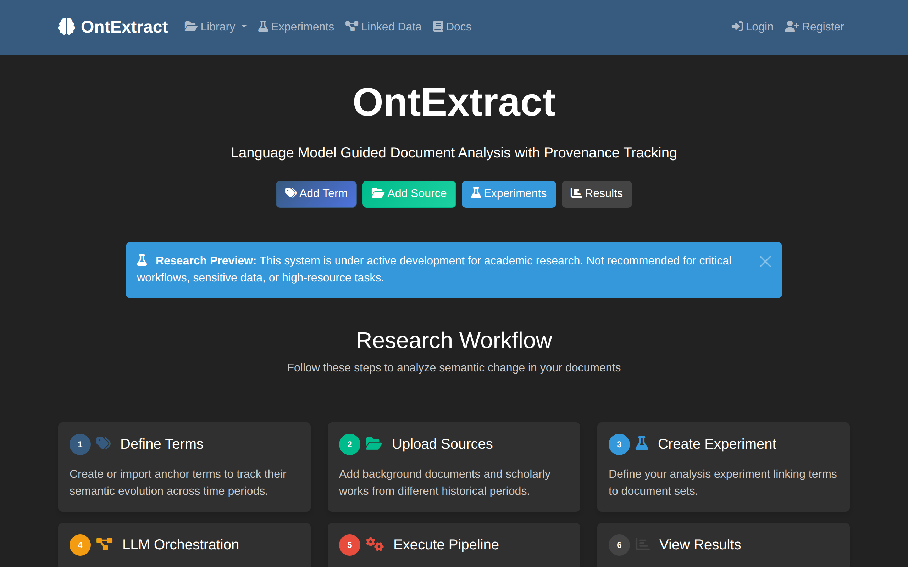

# OntExtract Documentation

Welcome to the OntExtract user manual.

## About OntExtract

OntExtract provides a unified interface for document processing with integrated provenance tracking. PROV-O provenance concepts are embedded directly in the database schema, and each processing operation creates a versioned output with corresponding provenance records.

The system operates in two modes:

- **Standalone mode** uses established NLP libraries (spaCy, NLTK, sentence-transformers) without external API dependencies
- **API-enhanced mode** adds LLM orchestration for automated tool selection and cross-document synthesis

Users can apply different processing strategies to the same documents and compare results while the system tracks complete analytical provenance.

## Quick Links

- [Getting Started](getting-started/installation.md) - Installation and initial configuration
- [First Login](getting-started/first-login.md) - Initial setup after installation
- [FAQ](faq.md) - Frequently asked questions

## Research Workflow

OntExtract guides you through a 6-step workflow for semantic change analysis:

| Step | Task | Guide |
|------|------|-------|
| 1 | **Define Terms** - Create anchor terms to track semantic evolution | [Create Anchor Terms](how-to/create-anchor-terms.md) |
| 2 | **Upload Sources** - Add documents from different historical periods | [Upload Documents](how-to/upload-documents.md) |
| 3 | **Create Experiment** - Link terms to document sets with temporal periods | [Create Temporal Experiment](how-to/create-temporal-experiment.md) |
| 4 | **LLM Orchestration** - AI suggests processing pipelines | [LLM Orchestration](how-to/llm-orchestration.md) |
| 5 | **Execute Pipeline** - Process documents with selected tools | [Process Documents](how-to/document-processing.md) |
| 6 | **View Results** - Explore semantic drift and provenance graphs | [View Results](how-to/view-results.md) |

## Core Features

### Document Management
Upload and manage historical documents with automatic metadata extraction from Semantic Scholar and CrossRef. Supports PDF, plain text, Word, and HTML formats.

### Anchor Terms
Define key concepts to track across your document corpus. Anchor terms serve as reference points for analyzing semantic change over time.

### Temporal Evolution Analysis
Track how term meanings change across historical periods using timeline visualizations and ontology-backed semantic change events.

### Document Processing
- **LLM Text Cleanup** - Fix OCR errors and formatting issues using Claude
- **Segmentation** - Split documents into paragraphs or sentences
- **Embeddings** - Generate vector representations for similarity analysis
- **Entity Extraction** - Identify named entities and concepts
- **Definition Extraction** - Extract term definitions using pattern matching with strict validation
- **Temporal Extraction** - Find dates, periods, and historical markers

### LLM Orchestration
In API-enhanced mode, the LLM analyzes your experiment and recommends processing strategies through a 5-stage workflow: Analyze → Recommend → Review → Execute → Synthesize.

### Ontology-Informed Design
Event types derived from a formally validated Semantic Change Ontology with 34 classes developed from 12 academic papers.

### Provenance Tracking
Complete W3C PROV-O provenance capture for all analysis steps. Every processing operation creates versioned outputs with queryable provenance chains.

## Getting Help

- Check the [FAQ](faq.md) for common questions
- Report issues at [GitHub](https://github.com/MatLab-Research/OntExtract/issues)

## About This Documentation

This manual covers installation, configuration, and usage of OntExtract features. Pages are organized by task and feature area.
