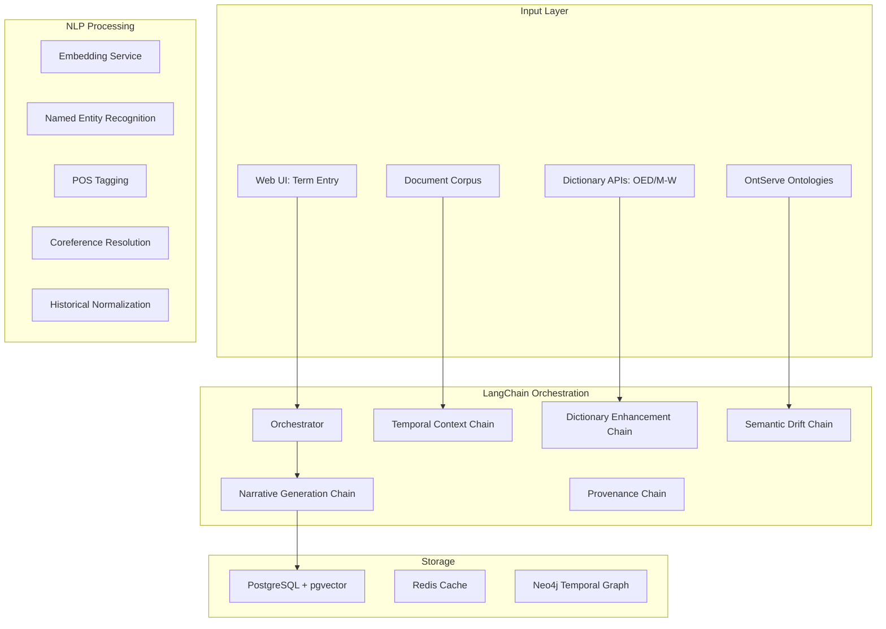

# Temporal Experiment LangChain Orchestration Plan

**Version**: 1.0  
**Date**: 2025-01-26  
**Status**: Planning Phase

---

## Executive Summary

This document outlines a comprehensive LangChain-orchestrated temporal analysis pipeline that integrates dictionary APIs (OED, Merriam-Webster), ontology services (OntServe), and advanced NLP tools to track semantic evolution of terms across time periods. The system uses multi-stage LLM orchestration to understand temporal context, detect semantic drift, and generate scholarly narratives about term evolution.

---

## 1. Architecture Overview

### 1.1 Core Components



### 1.2 Technology Stack

- **Orchestration**: LangChain + AsyncIO
- **LLM Providers**: Claude 3.5, GPT-4, Gemini Pro
- **NLP Libraries**: 
  - spaCy (POS, NER, dependency parsing)
  - NLTK (historical corpus access, collocations)
  - Gensim (topic modeling, word2vec)
  - Transformers (BERT embeddings, HistBERT)
- **APIs**:
  - Oxford English Dictionary (OED) API
  - Merriam-Webster API
  - OntServe MCP Protocol
- **Storage**: PostgreSQL with pgvector, Redis, optional Neo4j

---

## 2. LangChain Pipeline Design

### 2.1 Multi-Stage Temporal Analysis Pipeline

```python
from langchain.chains import SequentialChain, LLMChain
from langchain.prompts import PromptTemplate
from langchain.memory import ConversationBufferWindowMemory
from langchain.callbacks import get_openai_callback

class TemporalExperimentOrchestrator:
    """
    Main orchestrator for temporal semantic evolution experiments.
    Coordinates multiple analysis chains for comprehensive temporal understanding.
    """
    
    def __init__(self):
        self.chains = self._initialize_chains()
        self.memory = ConversationBufferWindowMemory(k=5)
        
    def _initialize_chains(self):
        return {
            'temporal_context': TemporalContextChain(),
            'dictionary_enhancement': DictionaryEnhancementChain(),
            'semantic_drift': SemanticDriftAnalysisChain(),
            'ontology_alignment': OntologyAlignmentChain(),
            'narrative_generation': NarrativeGenerationChain(),
            'provenance_tracking': ProvenanceTrackingChain()
        }
```

### 2.2 Stage 1: Temporal Context Extraction

**Purpose**: Extract and understand temporal context from documents and metadata

```python
class TemporalContextChain:
    """
    Extracts temporal context using NLP and LLM analysis.
    """
    
    def __init__(self):
        self.prompt = PromptTemplate(
            input_variables=["document", "term", "period"],
            template="""
            Analyze the temporal context of the term "{term}" in this {period} document.
            
            Document excerpt:
            {document}
            
            Extract:
            1. Temporal markers (dates, periods, era references)
            2. Historical context clues
            3. Contemporary events mentioned
            4. Linguistic period indicators (archaic forms, neologisms)
            5. Domain-specific temporal markers
            
            Provide confidence scores for each temporal element.
            """
        )
        
    async def extract_temporal_features(self, document, term, period):
        # NLP preprocessing
        temporal_entities = await self.extract_temporal_entities_spacy(document)
        historical_forms = await self.normalize_historical_spelling(document)
        
        # LLM analysis
        context = await self.llm_temporal_analysis(document, term, period)
        
        # Combine and validate
        return self.validate_temporal_context(temporal_entities, historical_forms, context)
```

### 2.3 Stage 2: Dictionary API Enhancement

**Purpose**: Enrich terms with historical dictionary data from OED and Merriam-Webster

```python
class DictionaryEnhancementChain:
    """
    Integrates OED and Merriam-Webster APIs for historical term analysis.
    """
    
    def __init__(self):
        self.oed_client = OEDAPIClient()
        self.mw_client = MerriamWebsterClient()
        
    async def enhance_with_dictionaries(self, term, time_period):
        # Fetch historical definitions
        oed_data = await self.oed_client.get_historical_entries(term, time_period)
        mw_data = await self.mw_client.get_etymology_and_history(term)
        
        # LLM synthesis
        synthesis_prompt = f"""
        Synthesize historical dictionary data for "{term}":
        
        OED Historical Data:
        {oed_data}
        
        Merriam-Webster Etymology:
        {mw_data}
        
        Create a unified temporal definition profile including:
        1. First known use and etymology
        2. Semantic evolution milestones
        3. Domain migrations
        4. Regional variations
        5. Obsolete meanings
        """
        
        unified_profile = await self.llm.generate(synthesis_prompt)
        return self.parse_dictionary_profile(unified_profile)
```

### 2.4 Stage 3: Semantic Drift Analysis

**Purpose**: Detect and quantify semantic drift using embeddings and LLM analysis

```python
class SemanticDriftAnalysisChain:
    """
    Analyzes semantic drift using multiple techniques.
    """
    
    def __init__(self):
        self.embedding_service = EmbeddingService()
        self.ontology_client = OntServeClient()
        
    async def analyze_drift(self, term_versions):
        # Embedding-based analysis
        embeddings = await self.generate_temporal_embeddings(term_versions)
        drift_metrics = self.calculate_drift_metrics(embeddings)
        
        # Context neighborhood analysis
        neighborhoods = await self.extract_context_neighborhoods(term_versions)
        neighborhood_drift = self.analyze_neighborhood_evolution(neighborhoods)
        
        # Ontology alignment tracking
        ontology_mappings = await self.track_ontology_alignment(term_versions)
        
        # LLM interpretation
        interpretation_prompt = f"""
        Analyze semantic drift for "{term_versions[0].term}":
        
        Quantitative Metrics:
        - Cosine distance drift: {drift_metrics['cosine_distance']}
        - Neighborhood overlap: {neighborhood_drift['overlap_coefficient']}
        - POS distribution change: {drift_metrics['pos_change']}
        
        Contextual Evidence:
        Period 1 context: {neighborhoods[0]}
        Period 2 context: {neighborhoods[1]}
        
        Ontology Evolution:
        {ontology_mappings}
        
        Provide:
        1. Drift classification (stable/gradual/abrupt/cyclical)
        2. Primary drivers of change
        3. Semantic field migrations
        4. Confidence assessment
        """
        
        return await self.llm.analyze(interpretation_prompt)
```

### 2.5 Stage 4: Ontology Integration

**Purpose**: Align terms with formal ontologies and track conceptual evolution

```python
class OntologyAlignmentChain:
    """
    Integrates with OntServe for ontology-based analysis.
    """
    
    async def align_with_ontologies(self, term, period, context):
        # Query OntServe for relevant ontologies
        ontologies = await self.ontserve_client.get_relevant_ontologies(term)
        
        # Find best concept matches
        matches = []
        for ontology in ontologies:
            concepts = await self.ontserve_client.search_concepts(
                ontology_id=ontology.id,
                query=term,
                include_context=context
            )
            matches.extend(concepts)
        
        # LLM-based alignment validation
        alignment_prompt = f"""
        Validate ontology alignments for "{term}" in {period}:
        
        Candidate Concepts:
        {matches}
        
        Historical Context:
        {context}
        
        Assess:
        1. Alignment confidence (0-1)
        2. Semantic precision
        3. Temporal appropriateness
        4. Domain relevance
        """
        
        validated = await self.llm.validate(alignment_prompt)
        return self.create_alignment_record(validated)
```

### 2.6 Stage 5: Narrative Generation

**Purpose**: Generate scholarly narratives about term evolution

```python
class NarrativeGenerationChain:
    """
    Generates human-readable evolution narratives.
    """
    
    async def generate_narrative(self, temporal_analysis):
        # Structure the narrative
        narrative_prompt = f"""
        Generate a scholarly narrative about the evolution of "{temporal_analysis.term}":
        
        Temporal Data:
        {temporal_analysis.temporal_context}
        
        Dictionary Evidence:
        {temporal_analysis.dictionary_data}
        
        Semantic Drift Analysis:
        {temporal_analysis.drift_analysis}
        
        Ontological Evolution:
        {temporal_analysis.ontology_alignments}
        
        Create a narrative that includes:
        1. Opening: Term introduction and significance
        2. Early Usage (Period 1): Context and meaning
        3. Evolution: Key transitions and drivers
        4. Contemporary Usage (Period N): Current state
        5. Implications: Scholarly significance
        
        Style: Academic but accessible, with specific examples
        Length: 500-750 words
        """
        
        narrative = await self.llm.generate(narrative_prompt)
        
        # Add citations and references
        narrative_with_refs = await self.add_scholarly_apparatus(narrative)
        
        return narrative_with_refs
```

---

## 3. NLP Tool Integration

### 3.1 spaCy Pipeline

```python
class SpaCyTemporalProcessor:
    def __init__(self):
        self.nlp = spacy.load("en_core_web_trf")  # Transformer model
        self.nlp.add_pipe("temporal_entity_ruler")
        self.nlp.add_pipe("historical_normalizer")
        
    async def process(self, text):
        doc = self.nlp(text)
        
        return {
            'temporal_entities': self.extract_temporal_entities(doc),
            'pos_distribution': self.get_pos_distribution(doc),
            'dependency_patterns': self.extract_dependency_patterns(doc),
            'named_entities': [(ent.text, ent.label_) for ent in doc.ents]
        }
```

### 3.2 NLTK Historical Analysis

```python
class NLTKHistoricalAnalyzer:
    def __init__(self):
        self.brown_corpus = nltk.corpus.brown
        self.inaugural_corpus = nltk.corpus.inaugural
        
    async def analyze_historical_patterns(self, term, period):
        # Collocation analysis
        collocations = self.extract_collocations(term, period)
        
        # N-gram patterns
        ngrams = self.extract_temporal_ngrams(term, period)
        
        # Frequency distribution
        freq_dist = self.calculate_frequency_distribution(term, period)
        
        return {
            'collocations': collocations,
            'ngrams': ngrams,
            'frequency': freq_dist
        }
```

### 3.3 Transformer-based Embeddings

```python
class TransformerEmbeddingService:
    def __init__(self):
        self.models = {
            'modern': AutoModel.from_pretrained('bert-base-uncased'),
            'historical': AutoModel.from_pretrained('HistBERT'),
            'scientific': AutoModel.from_pretrained('scibert')
        }
        
    async def generate_temporal_embeddings(self, text, period):
        # Select appropriate model based on period
        model = self.select_model_for_period(period)
        
        # Generate embeddings
        embeddings = await model.encode(text)
        
        # Align to common space for comparison
        aligned = self.align_embeddings(embeddings)
        
        return aligned
```

---

## 4. API Integration Specifications

### 4.1 Oxford English Dictionary (OED) API

```python
class OEDTemporalIntegration:
    """
    Enhanced OED integration for temporal analysis.
    """
    
    async def get_historical_timeline(self, term):
        # Fetch complete entry
        entry = await self.oed_client.get_entry(term)
        
        # Extract temporal data
        timeline = {
            'first_use': entry.get('earliest_use'),
            'etymology': entry.get('etymology'),
            'sense_evolution': self.extract_sense_evolution(entry),
            'quotations': self.extract_dated_quotations(entry)
        }
        
        # Process with LLM for insights
        insights = await self.generate_timeline_insights(timeline)
        
        return {
            'raw_timeline': timeline,
            'insights': insights
        }
```

### 4.2 Merriam-Webster API

```python
class MerriamWebsterTemporalIntegration:
    """
    M-W API integration for etymology and usage.
    """
    
    async def get_usage_evolution(self, term):
        # Fetch collegiate and learner's dictionary entries
        collegiate = await self.mw_client.get_collegiate(term)
        learners = await self.mw_client.get_learners(term)
        
        # Extract temporal features
        evolution = {
            'etymology': collegiate.get('etymology'),
            'first_known_use': collegiate.get('date'),
            'usage_notes': collegiate.get('usage'),
            'synonyms_history': self.extract_synonym_evolution(collegiate)
        }
        
        return evolution
```

### 4.3 OntServe MCP Integration

```python
class OntServeMCPIntegration:
    """
    Integration with OntServe for ontology-based temporal analysis.
    """
    
    async def track_concept_evolution(self, term, periods):
        evolution = []
        
        for period in periods:
            # Query contemporary ontologies
            ontologies = await self.get_period_appropriate_ontologies(period)
            
            # Find concept alignments
            alignments = await self.find_concept_alignments(term, ontologies)
            
            # Track changes
            evolution.append({
                'period': period,
                'alignments': alignments,
                'confidence': self.calculate_alignment_confidence(alignments)
            })
        
        return self.analyze_concept_trajectory(evolution)
```

---

## 5. Temporal Experiment Workflow

### 5.1 Experiment Setup Phase

```python
async def setup_temporal_experiment(experiment_config):
    """
    Initialize a temporal evolution experiment.
    """
    
    # 1. Validate configuration
    config = validate_experiment_config(experiment_config)
    
    # 2. Initialize services
    services = {
        'orchestrator': TemporalExperimentOrchestrator(),
        'nlp_processor': SpaCyTemporalProcessor(),
        'embedding_service': TransformerEmbeddingService(),
        'dictionary_apis': {
            'oed': OEDTemporalIntegration(),
            'mw': MerriamWebsterTemporalIntegration()
        },
        'ontology_service': OntServeMCPIntegration()
    }
    
    # 3. Prepare document corpus
    corpus = await prepare_temporal_corpus(config['documents'], config['periods'])
    
    # 4. Initialize tracking
    experiment = TemporalExperiment(
        id=generate_uuid(),
        config=config,
        services=services,
        corpus=corpus
    )
    
    return experiment
```

### 5.2 Term Analysis Phase

```python
async def analyze_term_evolution(experiment, term):
    """
    Complete temporal analysis for a single term.
    """
    
    results = {
        'term': term,
        'periods': experiment.config['periods'],
        'analyses': []
    }
    
    # For each time period
    for period in experiment.config['periods']:
        # 1. Extract temporal context
        context = await experiment.services['orchestrator'].chains['temporal_context'].extract(
            corpus=experiment.corpus[period],
            term=term,
            period=period
        )
        
        # 2. Enhance with dictionary data
        dictionary_data = await experiment.services['orchestrator'].chains['dictionary_enhancement'].enhance(
            term=term,
            period=period
        )
        
        # 3. Generate embeddings
        embeddings = await experiment.services['embedding_service'].generate_temporal_embeddings(
            text=context['text'],
            period=period
        )
        
        # 4. Store period analysis
        results['analyses'].append({
            'period': period,
            'context': context,
            'dictionary': dictionary_data,
            'embeddings': embeddings
        })
    
    # 5. Analyze drift across periods
    drift_analysis = await experiment.services['orchestrator'].chains['semantic_drift'].analyze(
        term_versions=results['analyses']
    )
    
    # 6. Generate narrative
    narrative = await experiment.services['orchestrator'].chains['narrative_generation'].generate(
        temporal_analysis=results,
        drift_analysis=drift_analysis
    )
    
    results['drift_analysis'] = drift_analysis
    results['narrative'] = narrative
    
    return results
```

### 5.3 Provenance Tracking

```python
class ProvenanceTrackingChain:
    """
    PROV-O compliant provenance tracking.
    """
    
    async def track_analysis_provenance(self, analysis_activity):
        provenance = {
            '@context': 'https://www.w3.org/ns/prov',
            '@type': 'prov:Activity',
            'id': f"analysis_{analysis_activity.id}",
            'startedAtTime': analysis_activity.start_time,
            'endedAtTime': analysis_activity.end_time,
            'wasAssociatedWith': [
                {
                    '@type': 'prov:SoftwareAgent',
                    'name': 'LangChain Orchestrator',
                    'version': '1.0'
                },
                {
                    '@type': 'prov:SoftwareAgent', 
                    'name': agent.name,
                    'version': agent.version
                } for agent in analysis_activity.agents
            ],
            'used': [
                {
                    '@type': 'prov:Entity',
                    'id': doc.id,
                    'generatedAtTime': doc.date
                } for doc in analysis_activity.documents
            ],
            'generated': {
                '@type': 'prov:Entity',
                'id': f"result_{analysis_activity.result_id}",
                'value': analysis_activity.result
            }
        }
        
        return provenance
```

---

## 6. Advanced Features

### 6.1 Multi-Language Support

```python
class MultilingualTemporalAnalyzer:
    """
    Support for cross-linguistic temporal analysis.
    """
    
    def __init__(self):
        self.models = {
            'en': 'bert-base-multilingual-cased',
            'de': 'bert-base-german-cased',
            'fr': 'camembert-base',
            'es': 'dccuchile/bert-base-spanish-wwm-cased'
        }
        
    async def analyze_cross_linguistic_evolution(self, term, languages):
        # Parallel analysis across languages
        analyses = await asyncio.gather(*[
            self.analyze_in_language(term, lang)
            for lang in languages
        ])
        
        # Cross-linguistic comparison
        comparison = await self.compare_evolution_patterns(analyses)
        
        return comparison
```

### 6.2 Domain-Specific Analysis

```python
class DomainSpecificTemporalAnalyzer:
    """
    Specialized analysis for different domains.
    """
    
    DOMAIN_CONFIGS = {
        'scientific': {
            'embeddings': 'scibert',
            'ontologies': ['MESH', 'ChEBI', 'GO'],
            'corpora': ['PubMed', 'ArXiv']
        },
        'legal': {
            'embeddings': 'legal-bert',
            'ontologies': ['Legal-OWL', 'LKIF'],
            'corpora': ['Case Law', 'Statutes']
        },
        'literary': {
            'embeddings': 'literary-bert',
            'ontologies': ['CIDOC-CRM', 'FRBRoo'],
            'corpora': ['Project Gutenberg', 'Google Books']
        }
    }
    
    async def analyze_domain_evolution(self, term, domain):
        config = self.DOMAIN_CONFIGS[domain]
        
        # Use domain-specific models
        embeddings = await self.generate_domain_embeddings(term, config)
        
        # Query domain ontologies
        ontology_alignments = await self.align_with_domain_ontologies(term, config)
        
        # Search domain corpora
        corpus_evidence = await self.search_domain_corpora(term, config)
        
        return self.synthesize_domain_analysis(embeddings, ontology_alignments, corpus_evidence)
```

### 6.3 Visualization Generation

```python
class TemporalVisualizationGenerator:
    """
    Generate visualizations for temporal analysis.
    """
    
    async def generate_visualizations(self, analysis_results):
        visualizations = {
            'timeline': await self.create_timeline_plot(analysis_results),
            'drift_graph': await self.create_drift_visualization(analysis_results),
            'embedding_space': await self.create_embedding_projection(analysis_results),
            'network_evolution': await self.create_semantic_network_evolution(analysis_results),
            'heatmap': await self.create_usage_heatmap(analysis_results)
        }
        
        return visualizations
```

---

## 7. Implementation Roadmap

### Phase 1: Core Infrastructure (Week 1-2)
- [ ] Set up LangChain orchestrator framework
- [ ] Implement basic temporal context extraction
- [ ] Configure spaCy and NLTK pipelines
- [ ] Set up PostgreSQL with pgvector

### Phase 2: API Integration (Week 3)
- [ ] Integrate OED API with rate limiting
- [ ] Implement Merriam-Webster connector
- [ ] Connect to OntServe MCP endpoints
- [ ] Build caching layer for API responses

### Phase 3: Analysis Chains (Week 4-5)
- [ ] Implement semantic drift analysis chain
- [ ] Build dictionary enhancement chain
- [ ] Create ontology alignment chain
- [ ] Develop narrative generation chain

### Phase 4: Advanced Features (Week 6)
- [ ] Add multi-language support
- [ ] Implement domain-specific analyzers
- [ ] Create visualization generators
- [ ] Build provenance tracking system

### Phase 5: Testing & Optimization (Week 7-8)
- [ ] Comprehensive testing with historical datasets
- [ ] Performance optimization
- [ ] LLM prompt tuning
- [ ] Documentation and examples

---

## 8. Example Usage

```python
# Initialize experiment
experiment = await setup_temporal_experiment({
    'name': 'Cloud Computing Evolution',
    'terms': ['cloud', 'virtual', 'container', 'serverless'],
    'periods': [1990, 2000, 2010, 2020],
    'domains': ['technology', 'business'],
    'corpora': ['ACM Digital Library', 'IEEE Xplore', 'Business Journals']
})

# Analyze term evolution
for term in experiment.config['terms']:
    analysis = await analyze_term_evolution(experiment, term)
    
    # Generate visualizations
    visuals = await generate_visualizations(analysis)
    
    # Save results
    await save_analysis_results(analysis, visuals)
    
    # Track provenance
    provenance = await track_analysis_provenance(analysis)
    await save_provenance_graph(provenance)

# Generate comparative report
report = await generate_comparative_report(experiment)
print(report.narrative)
```

---

## 9. Quality Assurance

### 9.1 Validation Strategies
- Cross-validation with human expert annotations
- Comparison with established linguistic databases
- Temporal consistency checks
- Ontology alignment validation

### 9.2 Confidence Scoring
- Multi-model consensus for drift detection
- Dictionary corroboration scoring
- Corpus coverage metrics
- Temporal distribution validation

### 9.3 Error Handling
- Graceful degradation for missing time periods
- API failure fallback mechanisms
- Embedding alignment error correction
- Narrative coherence validation

---

## 10. Conclusion

This LangChain-orchestrated temporal experiment pipeline provides:

1. **Comprehensive Analysis**: Multi-faceted approach combining embeddings, NLP, APIs, and LLMs
2. **Scholarly Rigor**: PROV-O compliant tracking with full audit trails
3. **Flexibility**: Modular design supporting multiple domains and languages
4. **Automation**: End-to-end pipeline from term entry to narrative generation
5. **Integration**: Seamless connection with existing OntExtract infrastructure

The system enables researchers to track semantic evolution with unprecedented detail and accuracy, supporting both computational linguistics research and digital humanities applications.

---

## Appendices

### A. Configuration Schema
```yaml
experiment:
  name: "Term Evolution Study"
  type: "temporal_evolution"
  terms:
    - term: "cloud"
      variants: ["clouds", "cloudy", "cloud-based"]
  periods:
    start: 1990
    end: 2020
    interval: 5  # years
  corpora:
    - name: "Academic Papers"
      source: "arxiv"
      filters:
        domain: "computer_science"
    - name: "News Articles"
      source: "news_api"
      filters:
        language: "en"
```

### B. Output Format
```json
{
  "term": "cloud",
  "evolution": {
    "1990": {
      "meaning": "meteorological phenomenon",
      "context": ["weather", "rain", "sky"],
      "frequency": 0.003
    },
    "2000": {
      "meaning": "network computing resource",
      "context": ["server", "internet", "distributed"],
      "frequency": 0.001
    },
    "drift_metrics": {
      "semantic_distance": 0.73,
      "domain_shift": "nature → technology",
      "confidence": 0.89
    }
  },
  "narrative": "The term 'cloud' underwent significant semantic evolution..."
}